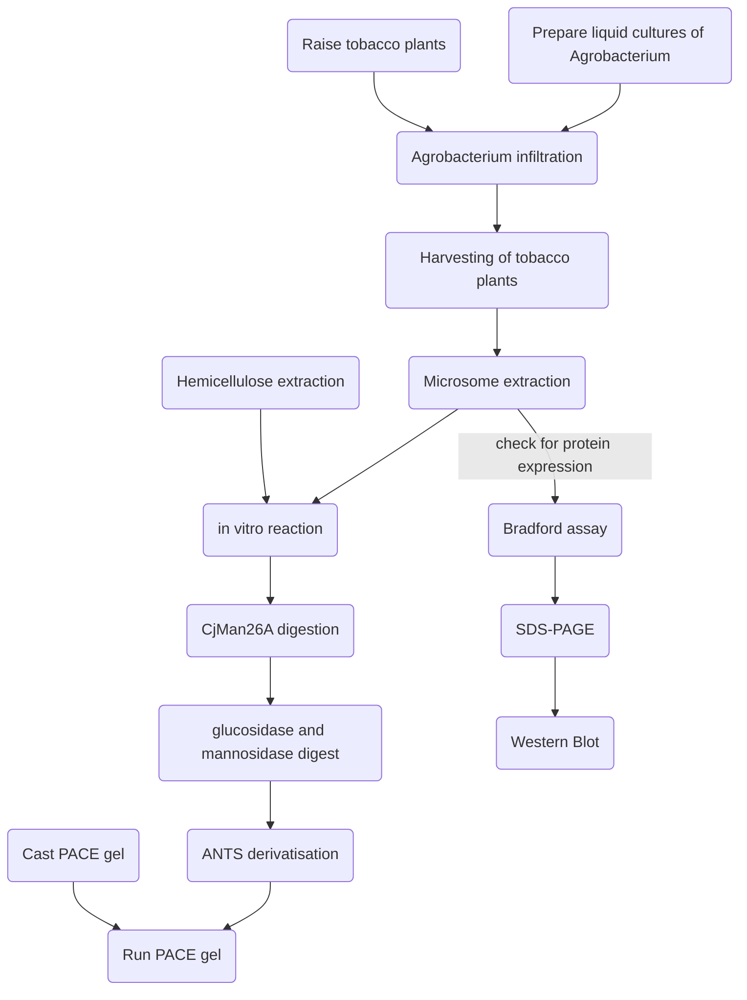
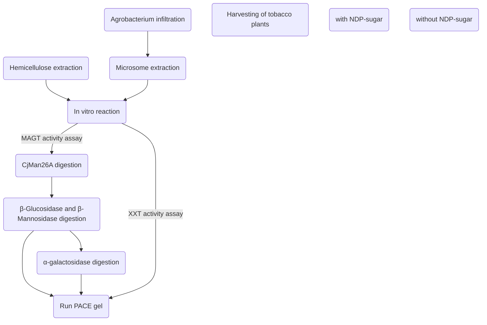

# Protocols
[[Polysaccharide analysis by carbohydrate gel electrophoresis (PACE)]]

[[Raising tobacco plants]]

[[Colabfold]]

[[Hemicellulose extraction]]

[[CjMan26A digestion]]

[[Agrobacterium liquid culture]]

[[Agrobacterium infiltration]]

[[Ethanol precipitation for polysaccharide cleanup]]

[[Microsome extraction from tobacco leaves]]

[[Bradford Assay]]

[[PAGE#Running PAGE (Dupree lab system)]]

[[Western Blot]]

[[GT34 in-vitro activity assay]]

[[GT34 in-vitro competition assay]]

[[Purification of GT34 proteins]]

[[Structural analysis of GT34s]]

[
# Workflow overview (so far)

