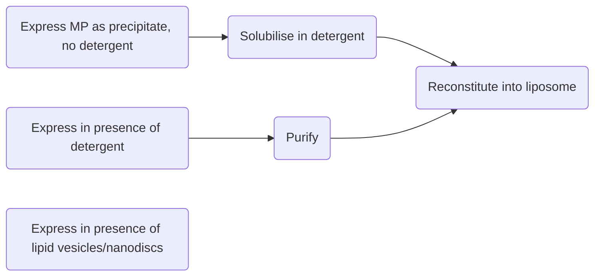

# Questions 
-   Structural determination of membrane proteins 
	- Which method would you use to solve the high-resolution structure of a membrane protein of 90 kDa? Justify your choice of method.
- Complementarity of structural techniques in membrane protein structure determination
	- Discuss the statement, “Solid state NMR is the only high resolution structure technique that enables the study of membrane proteins in their native lipid environment”.
	- The structure of a particular membrane protein has been solved by X-ray crystallography. What additional information can be obtained by further structural investigations?
	- What are the benefits of a multi-technique approach to determine the structure of membrane proteins?
	- Many membrane receptor proteins consist of a transmembrane domain that is attached to large extracellular and cytoplasmic domains. What general strategy would you follow to determine the structure of such a multi-domain protein? What problems would you anticipate in particular for the study of the transmembrane portion of such a protein?
-   Challenges in membrane protein structural determination 
	- Describe the experimental challenges that need to be overcome for the structure determination of membrane proteins by solution NMR spectroscopy
- Why do different structural techniques produce different structures for membrane proteins? How can the correct structure then be determined? 
	- Explain why the outcomes of X-ray crystallography and NMR structural studies of the same membrane protein might differ and describe the possible implications of such a scenario.
	- X-ray crystallography and NMR studies frequently make use of different membrane mimetics. These two methods produce high resolution structures of membrane proteins that rarely agree with each other. How would you decide which structure is the correct one?

# Context 
Studying membrane proteins is important for understanding  
- Membrane fusion and viral infection (for viruses that infect via fusion with membranes, e.g. influenza)
- Membrane signalling 
- Drug uptake/efflux, drug targeting & resistance 
- Role of membranes in molecular function 
- Disease – when membrane components are defective

# Structure of membranes 
- The “fluid mosaic” model (Singer & Nicholson 1972) is now considered archaic, with Engelman (2005) describing an updated version where the membrane is more “mosaic” than “fluid” 
	- Fluid mosaic – isolated monomeric proteins that randomly diffuse in a 2D lipid fluid
	- Updated model – the membrane contains segregated regions of structure and function (i.e. microdomains, e.g. rafts), and there is variation in lipid thickness + composition across the membrane. Crowding of membrane components limits the exposure of lipids to H2O
- Membrane composition (lipid, protein, cholesterol) varies across species, cell type, and organelle type 
	- Within the lipids, there is a large diversity as well in terms of length, charge, saturation, functional group, and shape 
- Membrane lipids interact with membrane proteins 
- Membranes are "fluid bilayers" that have a particular phase transition temperature. Below this temperature, they become gel-like, and above this temperature, they are more fluid 

# Known properties of membrane proteins 
- Membrane proteins are poorly characterised, making up less than 1% of PDB atomic resolution structures 
- Membrane proteins can be integral or peripheral 
	- Integral – monotopic (only embedded in one leaflet) or transmembrane 
		- Transmembrane – bitopic (inserted into membrane once) or polytopic (inserted multiple times)
	![[Pasted image 20221214160305.png|300]]

- General structure of integral membrane proteins 
	- α-helical – typically consists of 1-45 helices, found mostly in cytoplasmic and subcellular membranes
	- β-sheet – typically consists of 8-22 strands, found mostly in bacterial outer membranes, mitochondria, and chloroplasts 

## Interactions of membrane proteins with membrane lipids 
- **Removing hydrophobic mismatch**: Integral proteins are arranged in the membrane in such a way that their hydrophobic componenents interact with the hydrophobic core of the membrane, while their hydrophilic components interact with the hydrophilic phosphate heads and external environment 
	- If the protein is simply arranged vertically within the membrane, there is a mismatch between the hydrophobic component of the protein and the hydrophobic component of the membrane, so the protein may adjust or the membrane may adjust to prevent this mismatch (Killian & Nyholm, 2006) – plasticity of protein/membrane ![[Pasted image 20221214161045.png|475]]
- **Relieve membrane curvature frustration**: When membrane leaflets are forced into a linear bilayer, there is "curvature frustration" because the individual leaflets prefer to curve. This curvature frustration can be relieved by the insertion of proteins with an hourglass shape 
		![[Pasted image 20221214161507.png|275]]

- **Generate membrane curvature**
- **Headgroup interactions**
- **Transmitting conformational changes between protomers**: E.g. [[QiuEtAl_2018]] propose that the lipid bilayer in the central cavity of AcrB senses conformational changes that occur in each transmembrane domain and then transduces the effects of these changes to neighbouring protomers ⇒ harmonisation of conformational changes 
- **Regulation of protein activity**: E.g. AcrZ and membrane lipids cooperate to allosterically modulate AcrB activity (determine by [[DuEtAl_2020]] via cryo EM), by inducing structural alterations in the drug entry and binding sites", with "cardiolipin and AcrZ... encourag(ing) a more discrete binding mode for chloramphenicol in the AcrB distal pocket" 
- Other functions of membrane proteins 
	- Transporters
	- Receptors 
	- Channels 
	- Enzymes
	- Transducers 
	- Relieve membrane curvature frustration 

# Challenges in the structural determination of membrane proteins 
- Poor expression 
- Low stability once outside the membrane 
- Hydrophobic – aggregate in water 
- Membrane proteins are often contain disordered or intrinsically flexible domains 
- Membrane mimetics may interfere with function 
- Reconstituted complexes are often large 
- There are frequently extracellular (hydrophilic) domains that are sensitive to detergent 

# Methods for membrane protein expression 

## Protein expression systems 
To address poor expression of membrane proteins in native systems 

### Overview 
![[Pasted image 20221214162411.png|500]]

### E. coli
- Overexpression of membrane proteins in *E. coli* often results in lysis and death
	- This might be resolved by over-expressing the membrane protein into and extracting it from inclusion bodies, then refolding the protein *in vitro* and then reconstituting in detergent micelles. But refolding can be difficult, particularly for α-helical proteins compared to β-sheet proteins 
	- Another method is to constutively express and fold the membrane protein in *E. coli* (i.e. *not* overexpress it), then subsequently extract the proteins from bacterial membranes and transfer it to detergent micelles – but this results in lower yields 

### Cell-free expression (in-vitro translation system)
![[Pasted image 20221214162900.png|500]]

#### Workflows for cell-free systems 
1. Membrane protein is expressed as a precipitate, solubilised in a detergent, and reconstituted into proteoliposomes 
2. Membrane protein is expressed in a soluble form in the presence of detergent, purified then reconstituted into proteoliposomes 
3. Membrane protein is expressed directly in the presence of lipid vesicles or nanodiscs (obviating reconstitution into proteoliposomes)

#### Advantages 
- Can be used to study transcription and translation mechanisms 
- Incorporate unnatural amino acids 
- Incorporate isotope-labelled amino acids 
- Translate PCR products 
- Express toxic proteins 
- Express proteins sensitive to proteolysis 
- Less detergent, lipids, isotopes needed 
- Fast (~5-24h)
- For same amount of protein, cost is similar to using *E. coli* expression 
- Studying GPCRs? 
	- If the protein is first expressed as a precipitate, it is in an inactive conformation, but could then be made active upon refolding into a membrane mimetic system 

#### Disadvantages 
- Large amounts of DNA, RNA needed 
- Protein oxidation may occur
- Highly concentration dependent 

## Membrane mimetic systems 
For solubilisation of expressed membrane proteins 

- Membrane mimetic systems aim to imitate native lipid bilayers and thus solubulise the protein, keep the protein functional, maintain its oligomeric state 
- However, membrane mimetics are still just <u>approximations</u> of bilayers, and lipid effects are still little understood  

### Detergents 
- Amphipathic molecules. At critical micelle concentration, detergent monomers aggregate into micelles 
- Detergents differ in terms of charge, MW, CMC, aggregation number, hydrophilic-lipophilic balance, alkyl chain length, pH, purity, ionic strength, etc. 
- The choice of detergent has to be optimised for the particular kind of protein, and a screening process of may detergents + conditions are done: 
	- Functional assay – Can the protein continue to bind its ligand / maintain its signaling function in the presence of the detergent? 
		- A <u>drawback</u> of detergents is that they also remove protein-associated lipid molecules, which may be important to the activity of the protein, e.g. activity of mitochondrial respiratory complex I extracted with detergents suffers from depletion of lipid components 
	- Thermal stability – If NMR is being used, then need to check if the sample half-life is long enough (several days) as NMR data recording is slow 
	- ==Size of protein-detergent complex – using dynamic light scattering or analytical size exclusion chromatography== 
		- Important for NMR – can't be too big 
		- MW is not additive but is more complex 
	- Quality of NMR spectra – record 2D 15N HSQC-type experiments and assess the line widths, spectral peak dispersion (refer to notes on NMR of non-membrane proteins)
		- Excess of detergent improves spectral quality as the likelihood of one protein per micelle increases – however if the detergent concentration is too high, the sample viscosity becomes too high and the NMR signals will become broader again. So, need to optimize. 
- Detergent not recommended for single-helix protein studies – see the case of the [[A5 Preparing membrane proteins for structural study#Binding mode of adamantane drugs to the Influenza A M2 proton channel|influenza M2 proton channel]]

### Bicelles 
- Mixtures of short acyl chain <u>detergent</u> and a long acyl chain <u>lipid</u>, and are better mimics of bilayer systems than detergent micelles 
- Small bicelles are better for solution NMR, while large bicelles are suitable for solid state NMR 

### Amphipols (amphipathic polymers) 
- Polymers consisting of a synthetic mixture of sidechains that bind in a stoichiometric manner to the protein of interest 
- Size amenable for solution NMR spectroscopy 

### Nanodiscs 
- Lipid bilayer held together by a scaffold protein (apolipoprotein A-1 fragments) 
- #experimental_evidence CD4 receptor fragment (residues 372-433 containing the TM domain) was expressed in a nanodisc 
- Can be used for solid state NMR, #experimental_evidence  cytochrome P450 3A4 (human, residues 12-502). The N-terminal lipid anchor and hydrophobic domains are missing in the X-ray structure, and the protein is not functional because membrane interactions affect the specificity of ligand binding. Embedding into nanodiscs results in a functional protein. 
- Can also be used with cryo-EM (see [[QiuEtAl_2018]])

#### Advantages 
- The size of the nanodisc can be varied for different size proteins, as we want the nanodisc size to be kept as small as possible while still being large enough to accommodate the protein 
- Mixture of lipids can be used 
- Non-denaturing 
- Solubilises protein within native lipids 

#### Limitations 
- While nanodiscs mimic the natural membrane well, they are rather large for solution NMR, and smaller size systems would give better NMR spectra due to faster tumbling; in contrast detergent micelles are often smaller, the membrane protein is often not functional 
	- The solution may be to combine the two approaches by using the 1H-15N HSQC spectrum of the membrane protein in a nanodisc as a reference to screen for a detergent that gives a similar protein spectra as the nanodisc sample
		- This approach works but may be overly conservative as some detergents may cause minor changes in the spectrum due to changes in the environment even if the membrane protein is actually functional 
		- #experimental_evidence In one NMR study of VDAC-1, the protein was solubilised using the detergent LDAO. To determine whether the study in LDAO was representative of native conditions, the NMR spectrum was compared to when VDAC-1 was embedded in NLP. Furthermore, when VDAC-1 was titrated with β-NADH, which closes the channel, similar shift changes were seen between LDAO and NLP. 

### Saposin-A lipid nanoparticles
- Saposin is a lysosomal protein and activator of various lysosomal lipid-degrading enzymes #question – how does this work? 

### Nanoparticles 
- Similar to nanodiscs, they are discs of lipids enclosed by a synthetic polymer 
- E.g. SMALPs – styrene maleic acid (SMA) lipid particles 
- #experimental_evidence In their study of AcrB, [[QiuEtAl_2018]] used *<u>native cell-membrane</u>* nanoparticles using membrane-active SMA polymers based on a methodology developed by Lee et al (2016)
	- AcrB interacts extensively with lipids both in the central cavity and in the outer belt of the nanoparticle. In particular, the guanidyl group of R8 on subunit B in the T state forms a hydrogen bond with the phosphate of lipid 9 in the inner leaflet and the corresponding R8 on subunit C in the O state hydrogen bonds to lipid 5 phosphate 
	- The researchers pointed out that natural lipid bilayers are fluid to adapt to conformational changes in membrane proteins, and membrane mimetics must be able to do the same.
	- Qiu et al developed a system where the protein can be extracted with its native local membrane structure intact and is truly detergent-free, whereas apolipodisc, bicelle or saposin alternatives require detergents at some stage 

## Which method should be used? 
- Each approach has limitations
- For each method, different types of membrane mimetics can be used 
- Important to evaluate what the research question and biological function of the membrane protein is 

| Criteria   | X-ray crystallography | Solution NMR | Solid state NMR |
| ---------- | --------------------- | ------------ | --------------- |
| Detergents | Bicelles, LCP         | Detergents, small bicelles, nanodiscs             |Bicelles, liposomes, nanodiscs                 |
| Problems   | No dynamics                      | Size             |Complexity                 |
| Strength   | Size                      |Dynamics              |Orientation, dynamics                 |

## Methods may sometimes differ in results 
### Reasons 
- **Temperature** – mobility of flexible regions increases with higher temperatures
	- This can make NMR peaks "disappear" due to chemical exchange if the rate of chemical exchange is faster than the NMR timescale 
- **Use of detergent** – may disrupt structure of protein 
- **pH** – pH can affect structure of protein, and for some proteins can cause changes in conformation (e.g. proton channels)
- **Concentration of ligand** – if huge excess of ligand used, may force some kind of interaction that is not physiologically relevant 
- **Static structures** – do not provide full picture of dynamics. Intermediate, high-energy states cannot be captured by static techniques (XRC, Cryo-EM)

### Examples 
#### VDAC-1 
- NMR and X-ray differed in the N-terminal region
- NMR – only residues 6-10 visible, forming a shorter helix
- X-ray – all residues 1-25 are visible, forming a longer helix. But each of the X-ray studies had the helix in different conformations 
- This difference was probably because the helix is a flexible region that moves to regulate the opening of the channel – in XRC, the study was done at -197°C which freezes the helix in place, while in NMR the study was done at 30°C. Residues 6-10 remained visible because they remain fixed, being the hydrophobic anchor of the helix to the wall of the channel (as confirmed by later NOE studies). Residues 10-25 move and were thus invisible on the NMR due to intermediate exchange in the micelles 
	- Electrostatic hinge (XRC) vs hydrophobic-anchor flexible hinge (NMR)
- When the structure was determined using solid state NMR in DMPC liposomes, all peaks were observed since chemical exchange not possible (no movement)

#### Binding mode of adamantane drugs to the Influenza A M2 proton channel 
- Adamantane drugs inhibit the M2 proton channel 
- Solution NMR of rimantadine with M2 suggests an indirect (allosteric) model where the drug binds to the outside of the channel, with 4 drug molecules per channel 
- However, X-ray crystallography of amantadine with M2 suggests a channel blocking model where 1 drug molecule binds to the pore 
- One reason for the difference in results could be differences in methodologies:
	- The solution NMR study used a very harsh detergent (DPC) which could have disrupted the tertiary structure of the protein and hence disrupt binding 
	- The studies were done at different pH's – NMR at neutral pH, X-ray at low pH. But, we know that pH affects the state of M2 proton channel, with the channel in the closed form at neutral pH (NMR) and open in low pH (X-ray)
	- NMR study used a huge excess of ligand, which might have forced some kind of interaction that is not physiologically relevant. Perhaps the binding site is a 2nd low affinity one. In contrast, X-ray used a 1:1 drug to protein tetramer ratio. 
	- X-ray used a short construct M2(22-46), which has lower activity than the WT
- To resolve these differences, tried solid state NMR in neutral pH (closed state) with DMPC bilayer and amantadine 
	- At low ligand concentrations, the drug binds inside the pore with 1 drug per channel
	- BUT at high ligand concentrations, there was additional binding outside the channel, with a 100x affinity difference (which is not relevant at in-vivo drug concentrations) ⇒ 2nd interaction site due to saturation 
	- However, the solid state NMR study was also limited by the fact that it only used M2(22-46), similar to the X-ray study 
- Another ssNMR study done with a longer construct (residues 18-60), neutral pH, lipid environment, with rimantadine continued to support the pore binding model as the largest chemical shift changes that occurred upon rimantadine binding were concentrated at pore binding sites 
- In future, studies of single helix proteins should use bicelles or bilayers rather than detergents to avoid disruption of the protein structure  
- However, it is still unclear why the solution NMR study did not see the ligand inside the pore. 

#### G-protein coupled receptors 
- Static views of structure do not explain pharmacology – static structures present a binary view of GPCR states as either "active" or "inactive", when different levels of ligand concentrations result in graded changes in efficacy of the GPCR ⇒ multiple intermediate states, probably high energy and cannot be captured by static techniques (XRC, Cryo-EM)

# Links to other topics 
- [[A2 X-ray crystallography#Membrane XRC]]
- [[A3 Cryo-EM#Membrane Cryo EM]]
- [[A4 NMR#Membrane protein NMR]]
- [[C6 Cell walls, energy, materials]] – many GTs are embedded in Golgi or plasma membrane and have to be studied with membrane techniques 
- [[A7 G proteins#GPCRs|GPCRs]] are membrane proteins, so they have to be studied with membrane techniques 
- Many [[C1 ER Targeting and Integration|ER targeting pathway]] proteins are embedded in membrane