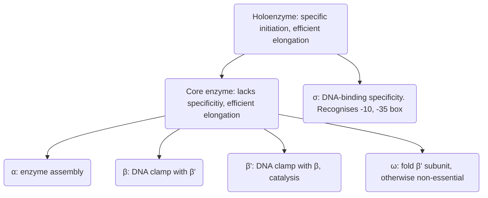

Notes are built onto IB notes [02 Control of Gene Expression](https://docs.google.com/document/d/1lQQpZkmM_34ZKaOeN63iJbSwwx8rp5fHReACmzEgNh0/edit#heading=h.kkfp7xqoyw1d)

# Essay questions 
- Initiation 
	- ==*How does the “promoter escape process” limit the rate of transcription by RNA polymerase II?*==
		- Promoter proximal pausing – mention? 
	- *==Describe the components of the transcription pre-initiation complex and their roles.==*
	- Roles of TBP-associated factors 
		- Discuss the roles and relative importance of TBP-associated factors in transcription initiation by RNA polymerase II.
		- Discuss the roles of TAFs (TATA-box binding protein associated factors) in transcriptional initiation and their relevance to transcription activation by RNA Pol II. 
- Regulation of transcription 
	- Role of CTD 
		- How is the RNA polymerase II carboxyl-terminal domain (CTD) involved in modulating transcription?
		- *==Discuss the roles of the carboxyl-terminal domain (CTD) of the large subunit of RNA Pol II in gene expression==*
	- Bacteria, yeast and higher eukaryotes regulate transcription in different ways. Discuss the similarities and differences in these regulatory mechanisms and their functional significance.
	- How are post-transcriptional processes important in gene expression and its regulation in eukaryotes?
- Transcription factor binding 
	- ==*How do transcription factors find their target sites in the genome?*== **See BMB essay**
	- Describe the general structure and mechanism of action of transcription factors that show sequence-specific binding.
- Describe the impediments to transcription elongation. What is their nature and how are they overcome?
- Pausing 
	- What role does promoter proximal pausing have in the regulation of gene expression?
	- ==*At which locations along the gene length does RNA polymerase pause? why and how?*==
- Why does transcription by RNA polymerase II require hydrolysis of the β-γ bond of ATP? 
- Termination 
	- ==How is transcription terminated?==
- Experimental investigation of transcription  
	- *==With the increasing availability of sophisticated wet-experimental and computational approaches for genome and transcriptome-wide analyses, to what extent are detailed investigations of individual genes and mRNAs necessary to understand how gene expression is regulated? Illustrate your answer with reference to different stages of gene expression.==*
	- You have identified a mouse protein that you suspect to have a role in gene expression. The sequence of the protein contains a predicted RNA binding domain. **Describe how you would set about investigating the possible roles of the protein in gene expression**. (in silico, in vitro, in vivo methods; biochemical, genetic, structural, phylogenetic)
		- What is the cognate binding sequence for the protein? Which transcripts does the protein target? 
			- SELEX 
			- CLIP-Seq 
			- Followed by bioinformatic analysis of similar binding sites across the transcriptome 
		- What is the effect of protein binding on gene expression? 
			- Perturbation of protein binding *in vivo* via mutation, depletion, etc. 
			- In vitro translation reporter assay 
		- What components of the protein are important for its function? 
			- Mutational analysis
			- Structural studies e.g. cryo-EM 
		- What is the mechanism by which the protein changes gene expression? 
			- What protein-protein interactions does it have?
				- Mass spec methods 
				- Genetic methods – epistasy 
			- Is it just a steric effect? 
				- MS2 + stem loop system 
		- What is the pattern of expression of this protein across different tissues? 
			- Transcriptomics -> mass spec 
		- Is the role of the protein conserved across different species? 
			- Bioinformatic analysis of genome + transcriptome, based on homology
	- Discuss, with examples, **how chromatin immunoprecipitation (ChIP) is used to map transcription factors and histone modifications to specific genomic loci**.
	- You discover an uncharacterised transcript originating from a new transcriptional start site. **How would you initially characterise the new RNA and the regulation of its expression?** Which experimental techniques and computational analyses would you employ in your study?
		- Is the transcript protein-coding? What protein does it code for and what is its function? Otherwise, what is the function of the RNA? 
			- Look for structural motifs, features 
			- What are its interacting partners? 
			- RNAi, CRISPR KO, overexpression -> look for changes in gene expression patterns, cell behaviour, phenotype 
		- When is the RNA expressed? In what tissues, cell types, developmental stage, disease? 
		- Where is the RNA localised? 
		- Is its expression conserved across species? 
		- Does it have splice isoforms 
		- What *cis* regulatory sequence elements are there? What epigenetic or epitranscriptomic modifications are there? What regulatory proteins bind to these elements? 
		- ** Cancer genes are often subject to a barrage of these studies. 

# Transcription in prokaryotes
## Initiation
* No primer is used in synthesis → transcription initiation complex is less stable than DNA replication complex and so more difficult to start 
* Most mRNAs start with A or G (purine) at TSS

### NAD+ cap
* At certain promoters with +1A, NAD+ can be incorporated at +1 by RNAP instead of ATP 
    * NAD+ competes with ATP for direct incorporation by RNAP at +1 
    * NAD structure contains adenosine diphosphate 
    * Promoter sequence determines whether NAD+ can be incorporated 
* NAD+ cap stabilises mRNA 

### Promoter structure 

> [!image] Structure of promoter
> ![[Pasted image 20221218203320.png|500]]

* Specifies TSS (+1)
* Recognized by RNA polymerase and associated factors
* Consists of _cis_ elements upstream of TSS
    * -10 Pribnow box – TATAATG 
        * The melted non-template strand is recognised by σ region 2
        * DOWN mutations in this element inhibit promoter melting 
        * Contains many T’s sensitive to KMnO4 oxidation (which oxidises unpaired Py) 
    * -35 box – TTGACA 
        * Recognised by σ region 4 
        * DOWN mutations in this element inhibit initial binding 
        * -35 box is always 16-18bp upstream of -10 box – spacing is important to maintain the correct relative orientation of the two elements that is recognised by RNAP 
    * -10 and -35 consensus sequences are asymmetric, i.e. have no direct or inverted repeats → order of the -10 and -35 box sets the correct polarity for transcription 
    * UP element in highly active rRNA promoters – A3W4T4N3A3 (W = “weak” = A/T) 
        * ~20bp AT rich element upstream of -35 box
        * Recognised by α-CTD – binds to the minor groove and prefers the narrowed minor groove of A/T rich DNA 
        * The element can be displaced 10, 20 bp upstream and still remain active as long as it remains on the same side of the helix – each turn of the helix is ~10bp long, so it will maintain the same relative orientation to the TSS 
* Elements with high match to consensus are functionally stronger due to strength of interaction with σ factor 
    * E.g. Lac-UV-5 is a strong promoter as it has a perfect consensus -10 box
* Suboptimal promoters can be regulated by adjacent activator sites (e.g. CAP in lacZ promoter) or repressor sites (e.g. LacI in lacZ promoter) 
    * Hence, suboptimal promoters allow for degrees of regulation of transcription efficiency 

## RNA Polymerase structure 
A single core RNAP synthesises all mRNA, rRNA, tRNA 

- Core enzyme
	- More abundant than σ subunits
- α
	- enzyme assembly. 2 copies required 
	- α domains each have an N-terminal domain (α-NTD) that make contact with the β and β’ subunits 
	- α C-terminal domain α-CTD is connected to NTD by a flexible linker and can bind to DNA (e.g. at UP elements)
- β
	- Forms pincer with β' to act as DNA clamp, enclosing downstream DNA in elongation complex
	- Active site is located at base of cleft formed by ββ’ 
	- Targeted by rifampicin 
- β' 
	- Forms pincer with β to act as DNA clamp
	- Provides conserved NADFDGD motif essential for catalysis, as the Asp triad coordinates Mg2+ involved in phosphodiester bond formation
- ω
	- Helps fold β' subunit before it is recruited to α2β
	- Non-essential
- σ
	- DNA binding specificity 
	- Recognises -10 and -35 box in specific promoters 

### Structure of σ subunit
![[Pasted image 20221218203407.png|500]]
* Domains 2 and 4 contain helix-turn-helix motifs
* Domain 4 recognises the -35 box via the major groove 
* Domain 2 recognises the -10 box on the non-template strand in the melted transcription bubble
* Domain 1.1 is a negatively-charged DNA mimic that suppresses DNA binding when not part of RNAP holoenzyme 
    * In free σ, 1.1. Interacts with 4 to prevent DNA binding (autoinhibitory) 
    * In holoenzyme, 1.1 occupies a downstream DNA binding cleft to reduce non-specific DNA binding
        * This interaction is displaced upon promoter binding
*   Domain 3.2 is a linker region that occupies the RNA exit channel 

## Switching σ factor
* E. coli has 7 different σ factors 
* Each factor is specific to different promoter element sequences

### Sequence of events in initiation (prokaryotes/eukaryotes)
> [!image] Sequence of events in initiation
> ![[Pasted image 20221218203451.png|475]]

1. **Holoenzyme binds to DNA.** σ4 binds to -35 box to form closed binary complex 
2. **Promoter melting of -10 box** (at positions -11 to +3) to form open binary complex 
3. **Initial transcription of DNA**. Transcription bubble expands in a 3’ direction as successive NTPs are added. In the open binary complex, the second NTP binds with slightly higher affinity than the first due to base stacking interactions – binding of all subsequent NTPs occurs have higher affinity
4. **Multiple cycles of abortive initiation may occur** (at positions +2-9) that collapses the transcription bubble to its original state and releases products of 2-9nt 
	1. Interaction between nascent RNA and template strand is not very stable 
	2. Initiation and elongation complexes have different requirements  
		1. Initiation complex must be highly sequence-specific – high threshold for binding → instability? 
		2. Elongation complex must be sequence non-specific as it needs to transcribe the entire sequence until termination. It also has to be stable to ensure processivity  
	3. Breaking of RNAP-DNA and RNAP-RNA contacts during transition from initiation to elongation makes complex vulnerable to abortive initiation 
5. **Promoter escape** (at position +10) forming ternary elongation complex. If the nascent transcript is extended beyond ~9nt, the transcription bubble contracts from the 5’ end and the sigma factor exits 
	1. **In eukaryotes**, Pol II escape relies on the activity of the XPB helicase (see [[B1 Transcription#TFIIE and H|TFIIE and H]]) because Pol II PIC has very extensive protein-DNA interactions 
	2. TFIIH XPB helicase facilitates promoter escape by disrupting DNA:TFIIF interactions, as well as other interactions e.g. TFIIB B-finger in RNA exit channel 
		1. #experimental_evidence [[B1 Transcription#TFIIF|TFIIF]] Rap30 subunit that are mutated in the C-terminal DNA binding domain are defective for TFIIH-dependent transcription, and in the absence of TFIIH is more active than WT TFIIF ⇒ Rap30 interacts with dsDNA preferentially over ssDNA 
6. **Promoter proximal pausing** (at positions +20-50) occurs in **eukaryotes**
7. Elongation begins 

#### Converting to elongation complex
* During elongation, the DNA strands separate at the active site and turn at a right angle 
* Multiple contacts are broken: 
    * σ2 and -10 box  in melted non-template strand 
    * σ4 and -35 box
    * σ3.2 with RNA exit channel of RNAP 
    * σ4 with β
    * σ2 and 3 contacts with β and β’ 
    * α-CTD contact with UP element (if present) 
* New interactions form: 
    * RNA:DNA duplex with active site channel 
    * Clamp encloses downstream DNA
    * ssRNA interacts with RNA exit channel 

## Elongation 
* During elongation, phosphoester bonds are formed – 3’ OH group of the existing mRNA strand does a nucleophilic attack onto the P of the alpha phosphate, with PPi as the leaving group 
* The incoming base is specified via WC H-bonding to the template strand 
![[Pasted image 20221218203640.png|500]]

## Termination of transcription in prokaryotes 
* Termination is triggered by signals present in the transcribed RNA 
* Termination leads to dissociation of RNA Pol from its template and release of RNA

### Rho-independent  
1. When RNA polymerase reaches the 3’ end, it pauses due to the formation of a G-C rich hairpin 
2. RNA and template DNA dissociates due to the weak base pairing between a run of ~6 U residues in the RNA and the dA tract in DNA 

Involvement of NusA (?) 

Distinguish Rho-independent from Rho-dependent
* Isolate hairpins by digesting ssRNA with enzymes
* Studying termination – ChIP

#### Experimental evidence 
Termination is disrupted by 
* Mutations that destabilise the GC-rich hairpin 
* Mutations that stabilise the DNA-RNA hybrid after the stem loop
* Deletion of the poly(U) tract
* In vitro transcription with ITP in place of GTP 

### Rho-dependent
* Rho protein is a ring-shaped hexamer with RNA-dependent ATPase activity
* Rho also acts as a helicase 
* Rho recognises its binding sites (a C-rich region) and translocates along the RNA until it reaches RNAP where it induces dissociation of RNAP 
* A hairpin structure near the C-rich region pauses the RNAP to allow rho to reach it 

Where does Rho bind? 
* Footprinting
* UV-CLIP for Rho and sequence the RNA

Some genes can terminate with both Rho independent, Rho dependent 
Think about high throughput, global experiments 

# Regulation of prokaryotic transcription 
## Activator and repressor proteins
* Activator proteins upregulate gene expression (induction) 
    * Binds to inducers – small molecule 
* Repressor proteins downregulate gene expression (repression) 
    * Binds to co-repressor 
* Inducers and co-repressors are allosteric regulators 
* These regulatory proteins have two conformations 
    * One conformation is stabilised by inducer or co-repressor (cooperativity) 
    * One conformation binds to DNA with higher affinity 
* Regulatory proteins are often dimers for binding to symmetric binding sites (palindromic) 

## Structure of lac operon 
![[Pasted image 20221218204117.png]]
* Lac operon has two promoters 
    * _LacI_ promoter that is weak but constitutively active 
    * Regulated _lac_ promoter that is only activated when lactose is available and glucose is unavailable 
* -10 and -35 boxes are not exact matches to the consensus sequence, so CAP activator is needed to reach maximal levels of transcription 
* Operator (binding site for lac repressor) overlaps with transcription start site 

### Negative regulation of lac operon by lac repressor 
* Lac repressor is a tetramer
* Repressor blocks RNAP binding by binding to the operator, blocking the transcription start site 
    * Lac repressor recognises operator via N-terminal helix-turn-helix motif of one dimer docking into the major groove 
* Apart from the operator, there are additional repressor binding sites at +410 and -80. Lac repressor has to bind to at least one of these for full repression so that the repressor can loop out the intervening DNA 
* Binding of allolactose (inducer) releases repressor from operator by decreasing its affinity
    * Since the inducer does not affect affinity for non-specific sites on the DNA, the overall effect is to reduce specificity for the operator 
    * Natural inducers (e.g. allolactose) eventually metabolised by β-galactosidase, so activation only persists when lactose is available 
    * IPTG is an inducer that is not metabolised by β-galactosidase

### Positive regulation of lac operon by CAP 
* CAP is a dimer
* On its own, CAP (Apo-CAP) recognition helices are not position correctly for DNA binding as they are the wrong orientation and too far apart
* cAMP binding induces the folding of 3 additional turns of helix in the dimerisation domain → helices brought into correct orientation for DNA binding 
* CAP+cAMP binds to CAP binding site, which is a symmetric site upstream of RNAP 
    * DNA binding via helix-turn-helix motif in each monomer
    * One helix (7aa)  is a “positioning” or “stabilisation” helix that makes non-specific (electrostatic) contacts with the DNA backbone 
    * The other helix (9aa) is a “recognition” helix that docks into the major groove
        * Sequence-specific recognition occurs via H-bonding and van der Waals contacts 
        * R185, E181 hydrogen bond with a GC base-pair in the major groove
    * Binding of the DNA causes it to bend by ~90° towards the minor groove (which is A/T rich – makes minor groove narrower and easier to bend) 
* CAP+cAMP then stabilises RNAP interaction with DNA by interacting with the α-CTD domain 
    * This compensates for suboptimal -35 and -10 elements 
    * Activator bypass experiments (i.e. artificial recruitment) replace CAP+cAMP-RNAP interactions with artificial heterologous interactions to confirm that CAP only needs to recruit RNAP 
* CAP can also act at other promoters (e.g. Gal, Ara operons) 
![[Pasted image 20221218204134.png|500]]

## Attenuation 
Mechanism for repressing gene expression based on premature termination of transcription 

### Requirements for attenuation
Attenuation can only occur in prokaryotes because it requires that
* Transcription and translation are coupled
* mRNA folding is cotranscriptional (i.e. mRNA forms secondary structures before transcription is complete) 
* mRNAs can form alternative, mutually exclusive secondary structures 

### Attenuation in Trp operon 
![[Pasted image 20221218205225.png]]
* Leader region contains a leader peptide with two consecutive Trp codons, and four stem-loop forming elements with mutually exclusive conf ormations 
* Elements 3 and 4 are followed by a poly(U) track and form a ρ-independent terminator
* Once RNA Pol begins transcription, a ribosome can begin translation of the leader region

Note: His, Phe operons also controlled in similar way 

When Trp levels are low, whole operon is transcribed
![[Pasted image 20221218205250.png]]
* When Trp levels are low, the ribosome is stalled at the Trp codons – Trp is a relatively rare amino acid 
* Stalling of ribosome allows for the formation of an antiterminator hairpin (2:3) → prevents formation of terminator hairpin 

When Trp levels are high, transcription terminates prematurely before first structural gene 
![[Pasted image 20221218205302.png]]
* When Trp levels are high, the ribosome quickly translates the leader peptide and falls off the mRNA 
* This allows the terminator hairpin (3:4) and an associated hairpin (1:2) to form → transcription is terminated 

# Transcription in eukaryotes
## Main differences with prokaryotic transcription
* RNA Pol II cannot recognise promoters accurately on its own, requires GTFs that allow RNA Pol II to bind to promoter accurately 
    * GTFs analogous to σ factors 
* Nuclear/cytoplasmic compartmentation → transcription/translation are separate processes
* mRNA is monocistronic 
* mRNA is more stable, variable and regulutable 
* pre-mRNA undergoes post-transcriptional processing 
* Tighter transcriptional control due to a background of chromatin repression which represses any background transcription 

## Types of RNA Pol II 
* Pol I (nucleolus) – 45s pre-rRNA 
* Pol II (nucleoplasm) – pre-mRNA, most snRNAs 
* Pol III (nucleoplasm) – pre-tRNAs 

## Structure of RNA Pol II 
* RPB1-3 homologous to prokaryotic β’, β, α
* RPB4&7 are essential for initiation _in vivo_ by stabilising the closed configuration of the clamp (RPB1&2) domain. They narrow the active site cleft so that it is only accessible to ssDNA 
* RPB5, 6, 8 – also found ni Pol I and Pol III 
* Contains Mg2+ in the active site 

### RPB1 CTD 
* RPB1 C-terminal domain (CTD) contains multiple heptad repeats with consensus sequence YSPTSPS
    * Number of repeats vary between species 
    * Blocks of perfect consensus repeats are found towards the N-terminal end, with more variable repeats towards the C-terminal end 
* Unique to RNA Pol II (not found in Pol I, III, or β’) 
* Is flexible and easily proteolytically cleaved due to its accessibility 

#### CTD phosphorylation code 
- CTD can be phosphorylated at multiple residues; a total of **128** possible states of a single consensus repeat 
	- S2, S5 most often phosphorylated 
	- S7-P needed for transcription/processing of snRNAs
	- T4-P needed for 3’ processing of histone mRNAs (not polyA) 
	- Y1-P distinguishes elongation from termination phase 
	- P3 and P6 can be modified by peptidyl prolyl isomerases (cis-trans isomerisation of proline) if the prceding Ser is phosphorylated
- Phosphorylation states can be modified by kinases and phosphatases 
	- Pure [[B1 Transcription#TFIIE and H|TFIIH]] phosphorylates Pol II or CTD fusion protein on Ser-5 
	- Also phosphorylated by CDK7/Cyclin H (CTD kinase), which is activated by TATA+ promoters
* The phosphorylation state of the CTD determines which proteins it interacts with
	* CTD is joined close to Pol II body close to RNA exit channel to easily recruit RNA processing factors onto nascent RNA 
	* Initiation factors which bind non-phosphorylated CTD at the promoter e.g. TBP, Mediator complex (which is a complex of co-activators) 
	* Capping enzymes – bind S5-P CTD and usually acts in a promoter-proximal manner 
	* Splicing factors – recognise S2-P, S5-P e.g. Set2 H3K36 methylase
	* 3’ end cleavage factor Pcf11 – recognises S2-P 
* Phosphorylation state changes throughout transcription 
	- At initiation, CTD is hypo-phosphorylated in Pol IIa
		- IIa is recruited 4x more efficiently than IIo into PIC 
	- At elongation, CTD is hyper-phosphorylated in Pol IIo
	- S5P is promoter-proximal, while Ser2-P increases towards the 3’ end of transcription 
* CTD code elucidated using [[B1 Transcription#Chromatin immunoprecipitation (ChIP)|ChIP]]

## RNA Pol II promoters
### Identification of promoters
* TSS can be identified by aligning cDNA sequences to genomic DNA 
* Large scale sequencing of 5’ CAGE (cap analysis of gene expression) tags 
    * Selecting mRNA with caps ensures that start of mRNA is intact 

### Types of RNA Pol II promoters and their core elements
#### Sharp promoters 
* Have single TSS
* TATA box at -25 – repeating T82A97T93A85A63A88
* INR (Initiator) element at +1 in some promoters – YAYTCYYY
	* A = TSS
	* Y = Pyrimidine
- TATA box and INR element needed for accuracy of initiation 
    * These cis elements are present in single copy, have a fixed position relative to TSS, are asymmetric and orientation specific → precisely specify TSS and direction of transcription 
    * #experimental_evidence Deletion of TATA box results in several TSS (similar to broad promoter) and reduces transcription efficiency 
    * Usually tissue-specific 

#### Broad promoters 
* Has multiple start sites spread over ~150 nt
* No TATA or INR elements – not needed since promoter has no precise TSS 
* Enriched in CpG islands – regulated by DNA methylation 
* Includes many housekeeping genes → constitutively expressed 
* Recognition may be mediated by recognition of +1 nucleosome by TFIID, or by detecting bendability of the local DNA region (since architecture of Pol II PIC is similar at promoters of diverse sequence)

## Initiation in eukaryotes 

### Stepwise assembly of preinitiation complex

> [!image] Process of PIC assembly 
> ![[Pasted image 20221218204411.png|475]]

- Preinitiation complex is assembled onto the DNA in a **stepwise manner**. 
- Each step is cooperative as the binding of one factor stabilises the binding of subsequent factors 
- TATA box does not melt during initiation (cf prokaryotic -10 box) – transcription bubble only forms at +1

> [!NOTE] Process of PIC assembly 
> 1. D, A, B
> 	1. TFIID (TATA binding protein + TAFs) binds to the TATA box)
> 	2. TFIIA recruited by TBP to promoter 
> 	3. TFIIB recruited by TBP 
> 2. F, RNAP
> 	1. Assemble to form Pol II complex
> 	2. TFIIB helps Pol II complex bind correctly 
> 3. E, H
> 	1. Bind to complex to form transcription pre-initiation complex
> 	2. TFIIH ATPase and helicase activity unwind DNA to open transcription bubble, and destabilise protein-protein and protein-DNA interactions for promoter escape
> 5. ATP hydrolysis by TFIIH 
> 6. Release of TFIIB
> 7. Initiation begins 

### Alternative assembly models 

Apart from the stepwise model, other models of PIC assembly exist 
* **Holoenzyme model**: Instead of sequential binding, PIC assembly may occur in two steps: initial binding of TFIID and TFIIB, then recruitment of a holoenzyme consisting of RNAP II + other GTFs that are built outside the promoter 
* **Dynamic model:** PIC assembly is not strictly stepwise or two-step, but is more flexible where assembly pathways vary depending on the gene, environment, context, etc. 
	* The Mediator complex can perform **compensatory recruitment** of the PIC, meaning that it can facilitate PIC assembly even when some of the GTFs are missing, not assembled in the canonical order, or to stabilise weak interactions 
* It is possible that all these processes are occurring at promoters, but at different proportions at each promoter 

> [!image] Alternative models of PIC assembly 
> ![[Pasted image 20221218204444.png]]

## Role of GTFs in initiation 
* GTFs needed for accurate TATA-box dependent initiation 
* Recognise core promoter elements 
* GTFs assemble preinitiation complex with promoter and Pol II

### TFIID 
#### TATA binding protein (TBP) 
* Recognises TATA box via beta-sheet binding to minor groove 
    * Intercalation of Phe residues into minor groove causes 80° of bending of DNA → widens/flattens minor groove 
    * Specificity of TBP for TATA box arises from ability of A-T bp to be more readily distorted 
- At TATA box promoters, TBP without TAFs sufficient for in vitro basal transcription 
    * Not sufficient for activated transcription (e.g. Sp1 activation requires TAFs) 
- TBP also binds non-phosphorylated Pol II CTD 
	- #experimental_evidence After applying HeLa cell nuclear extract to a CTD affinity column, the resulting flowthrough fraction has no transcriptional activity. However, after adding TFIID or TBP to the flowthrough fraction, transcription is restored. 

#### TBP associated factors (TAFs)
* Required at non-TATA box promoters or for activator-dependent transcription (co-activators) 
    * dTAFII150 (*Drosophila* TAF1) binds to the INR element 
    * TBP + dTAF150 + dTAF250 (*Drosophila* TAF2) is sufficient for basal transcription from TATA-, INR+ promoter 
    * TAFII250 also has enzymatic activity – it acts as a Ser/Thr kinase that phosphorylates the TFIIF 74 kDa histone acetyltransferase subunit such that it acetylated H4 in vivo 
	    * Link between transcription and [[B3 Chromatin structure and gene expression|chromatin remodelling]]? 
- TAFs interact with different co-activators
	- E.g. Sp1 (Gln-rich) binds dTAF110 
	- E.g. NTF1 (Ile-rich) binds dTAF150 
	- E.g. Vp16 (acidic) binds dTAF40
		- #experimental_evidence anti-TAF40 antibodies inhibit Vp16 activation, but do not affect basal transcription 
 - Combinations of activators that target different TAFS can synergistically activate transcription 
	 - #experimental_evidence Sauer et al (1995) – bicoid (Gln-rich) activates via TBP + dTAF250 + dTAF110, while hunchback activates via TBP + dTAF250 + dTAF60. Together, they synergistically activate with TFIID/TBP + dTAF250 + dTAF110 + dTAF60 

#### TBP related factors (TRFs)
* _Drosophila_, mice, and humans also have TRFs (TBP related factors) that activate specific non-TATA box promoters 
    * #experimental_evidence Murine TF3 replaces TBP during myogenesis and is necessary for myogenic differentiation 
    * #comment See Levine and Tijan review 

### TFIIA
* Binds upstream of TFIID
* Required for activated transcription 
* For basal transcription, it is required with TFIID but not with TBP alone because it antagonises the interaction of TAFII250 with the DNA binding surface of TBP 
	* #question What is the functional significance of this? Cell wants TBP to bind to DNA, and TAF250 will block DNA binding in the absence of TFIIA? 

### TFIIB
* Binds across TSS (-10 to +10) and thus helps to specify the TSS 
    * #experimental_evidence Yeast TFIIB mutants have altered start sites 
* Contains a basic amphipathic helix that is a target of some acidic activators e.g. Vp16 
![[Pasted image 20221218204504.png|475]]

### TFIIF
* Binds at promoter with Pol II (+15 to +20), as well as TFIIB, D, and E 
* Reduces non-specific DNA binding by Pol II (analogous to bacterial σ1) and promotes Pol II recruitment to PIC 
* Subunits
    * RAP30 – binds Pol II along Clamp domain. Binds DNA in a non-sequence specific manner, with a preference for non-linear conformations 
    * RAP74 – activates FCP1, a CTD Ser-2-phosphatase 

### TFIIE and H
* Binding of TFIIE and H (with ATP input) converts the closed complex assembly to an open complex by allowing for promoter melting and clearance 
* **TFIIE** binds non-phosphorylated CTD and regulates TFIIH
* **TFIIH** has a **kinase** subunit that phosphorylates CTD, and a **helicase** subunit involved in promoter melting and clearance 
    * Kinase subunit phosphorylates RPB1 [[B1 Transcription#CTD phosphorylation code|CTD]] on Ser-5 
    * Helicase consists of two subunits, XPB (aka ERCC3 or p89) and XPD (aka ERCC2 or p80)
	    * XPB is a 3' to 5' ATP-dependent helicase while XPD is a 5' to 3' ATP dependent helicase
	    * XPB does not interact with the promoter region that undergoes melting, instead it rotates downstream DNA relative to fixed upstream protein-DNA interactions, which generates torque to unwind the intervening DNA ![[Pasted image 20221218204526.png|500]]
	    * Only XPB needed for promoter opening and escape, but both XPB and XPD needed for efficient transcription 

#### Importance of ATP hydrolysis 
* ATP specifically is required for promoter melting. UTP, CTP, GTP will not work 
	* #experimental_evidence When a “pre-opened” promoter is created (by using a heteroduplex promoter that is non-complementary at the -4 to +2 site), TFIIE, H, and ATP are not required for promoter melting and escape. Similar results were also found with negatively supercoiled plasmid template
	* #experimental_evidence [Holstege et al (1997)](https://www.embopress.org/doi/full/10.1093/emboj/16.24.7468) showed that ATP is required for promoter melting. The authors stalled RNA Pol II complex at defined positions on an adenovirus major late (AdML) promoter template by constructing a series of templates with G residues at varying positions. Then monitored promoter melting via KMnO4 oxidation (which preferentially oxidises T in ssDNA).  Addition of ATP increased the sensitivity of positions -9, -8, -5, and -2 
	* #experimental_evidence [Moreland et al (1999)](https://www.jbc.org/article/S0021-9258(18)81515-0/fulltext#seccestitle10) showed that TFIIH XPB DNA helicase plays a role in promoter escape by RNA Polymerase II. The authors constructed an XPB mutant that lacked helicase activity, as well as an AdML promoter with a pre-melted -9 to +1 region to investigate the post-initiation roles of TFIIH and ATP. Promoter escape was determined if RNAP II was able to synthesise an 18-nucleotide 3’-_O_-MeG terminated RNA transcript. Compared to the wt, the XPB mutant had much lower levels of 18nt RNA transcript synthesis, suggesting that XPB is important for promoter escape. 
* ATP dependency of initiation is NOT due to CTD phosphorylation:
	* #experimental_evidence CDK7/Cyclin H can use ATP OR GTP for CTD phosphorylation, while initiation strictly depends on ATP
	* #experimental_evidence In TATA+ AdML promoter, ΔCTD Pol II still needs ATP and TFIIH for in vitro transcription
	* #experimental_evidence Active site mutation of CDK7 does not impair basal in vitro transcription from AdML promoter 
- Upon initiation, the β-γ phosphate bond is hydrolysed 
	- #experimental_evidence When AMP-PNP is used where the β-γ bridging O atom is replaced by N, the non-hydrolysable β-γ bond prevents initiation 

### Mediator complex 
* While Pol II and GTFs are sufficient for basal transcription in reconstituted systems, an additional Mediator complex is needed in whole nuclear extract
* Mediator complex binds to Pol II via hypo-phosphorylated CTD 
* Regulates transcription in several ways: 
	* Contains co-activator and co-repressor subunits 
	* Involved in PIC assembly (see [[B1 Transcription#Alternative assembly models|dynamic model of PIC assembly]])
	* Involved in chromatin remodeling 

## Eukaryotic elongation 
### Elongation complex
![[Pasted image 20221218204552.png]]
* Rudder separation is important so that the RNA product can dissociate from the DNA template and leave the complex 

### Process 
* ATP is required for elongation – α-β phosphate bond is hydrolysed 

## Termination of transcription in eukaryotes
In eukaryotes, Pol II transcription carries on for ~100s to ~1000s of base pairs downstream of 3’ end as the pre-mRNA lacks discrete termination sites 

### Process
1. RNAPII transcribes through the conserved polyadenylation signal AAUAAA
2. Pol II transcription pauses downstream of the poly(A) site and endonucleolytic cleavage occurs 10-30 bases downstream from the signal to generate the mature 3’ end 
3. Polyadenylation of upstream cleavage product – poly(A) polymerases adds ~200 A bases to the 3’ ends to form poly-A tail 
4. Downstream cleavage product is degraded

Termination has to be coupled to dephosphorylation of Ser2-P 
Disassembly of elongation complex e.g. TFIIE, TFIIH

### Why run-on transcription? 
* Termination doesn’t seem to be as closely regulated as initiation in eukaryotes – this could be because the 3’ UTR in eukaryotes is very large, such that the exact position of cleavage does not need to be very precise 
* Facilitated reinitiation – specific to Pol III. After termination, Pol III binds to the initiation site to start synthesis of a new transcript 
    * Pol III genes are short as they transcribe tRNA genes (&lt;200bp) → easier to recycle, while Pol II genes are long → initiation and termination sites may be too far apart for recycling 

# Regulation of eukaryotic transcription
* While GTFs and core promoter elements are sufficient to activate transcription _in vitro_, they are insufficient to activate transcription fully in cells
* Higher complexity of transcription regulation in eukaryotes needed due to 	
    * Need to overcome repressive packaging in **chromatin** 
    * Large **size** of eukaryotic genomes – higher specificity is needed 
    * Need for tissue-specific or cell-specific expression in multicellular organisms – mediated by **regulatory/specific transcription factors** which bind to *cis* elements 
* Weak interaction and inefficiency are important for gene regulation – creates dynamic range in transcriptional activity 

## Proximal promoter pausing 
* In higher eukaryotes, RNAP II may pause again after promoter escape at a region close to the promoter (+20-50)
- #experimental_evidence [[KwakEtAl_2013]] used a technique called PRO-seq to map the positions of paused elongation complexes – they used biotinylated NTPs in nuclear run-on reactions, which allowed them to identify the locations of elongation complexes to base pair resolution. This experiment demonstrated that elongation complexes accumulate immediately downstream of the transcription start site. Some genes had pausing occur at sites that were more proximal and focused, while others have more distal and broader pausing regions, and the type of pausing site depended on the arrangement of core elements within the promoter. 

### Pause elongation complex and release
* At the pause region, two pausing factors, DSIF and NELF, associate with RNAP II to form the paused elongation complex 
    * #structural_evidence Vos et al (2017) used cryo-electron microscopy and found that in the paused elongation complex, the DNA-RNA duplex has a tilted conformation, which pauses transcription because there is no DNA template base in the active site of RNAP II that can anneal to a free ribonucleotide triphosphate. NELF itself also restricts the movement of RNAP II by associating with different modules within RNAPII. 
      ![[Pasted image 20221218204626.png|350]]
* Release of RNAP from the paused elongation complex is mediated by a Cdk, P-TEFb, and regulation of release is orchestrated by additional transcription factors
    * P-TEFb is made up of a catalytic subunit Cdk9 and regulatory subunit cyclin T
    * P-TEFb phosphorylates DSIF to cause dissociation of NELF, and CTD S2. This restores the tilt in RNA, allowing for RNAP start elongation 

### Function of promoter proximal pausing
* **Maintenance of permissive chromatin complex.** #experimental_evidence Gilchrist et al (2008) depleted cells of NELF via RNAi and identified genes that were down-regulated by this depletion using microarrays. When ChIP was used against histone H3 at these down-regulated genes, they found an increase in H3 quantity at the promoters of these genes, which suggests that when paused elongation complexes are lost, they are replaced by nucleosomes. 
* **Rapid activation of gene expression.** As the elongation complex has already been assembled, the gene can be quickly switched on upon the binding of transcription activators that associate with P-TEFb. Compared to the process of assembly of the preinitiation complex followed by promoter melting and clearance, this is a faster way to activate the gene.  ([More details here](https://www-nature-com.ezp.lib.cam.ac.uk/articles/ng.2007.21))
* **Integration of signalling pathways/additional point of regulation** as RNAP II has to be released from pausing in order for transcription to continue. In paused genes, at least two transcription activators  would be required for elongation, one that recruits general transcription factors (e.g. SP1), and another that releases the elongation complex from pausing (e.g. Myc). 
* **Checkpoint for early elongation**. Pausing provides a time window to check for and ensure correct 5’ processing of the RNA. 5’ capping usually occurs during the early stage of transcription when the RNA product is 20-30nt in length, and it has been found that most RNAs produced by paused elongation complexes are capped. 
	* #experimental_evidence Rasmussen et al (2003) demonstrated this with _Drosophila_ heat shock proteins. In *Drosophila* cells, nuclear run on assays found a set of transcripts between 20-30 nt long that existed in both heat shocked cells and non-heat shocked cells, suggesting that the RNA polymerase has paused early in elongation. These short transcripts were largely 5’ capped – using tobacco acid pyrophosphatase which removes 5’ caps, the transcripts were found to be reduced in length when run on a gel. 
	* Pausing may also ensure that the RNAP II C-terminal domain (CTD) is appropriately phosphorylated for binding by 3’ RNA processing factors. In particular, P-TEFb not only releases the complex from pausing, but also phosphorylates the paused Pol II, which may couple pause release to Pol II phosphorylation

## Promoter proximal elements 
### General properties
* Only affects transcription efficiency and not accuracy as they do not affect TSS position 
* Present only upstream of the TSS, usually within 200bp of TSS; Effect decreases with distance from TSS  
* Orientation independent 
* Multiple copies can be present – for binding to individual or dimeric TFs and for determining transcription efficiency 
* Often palindromic for binding dimeric TFs 
* Can be constitutive or inducible (e.g. for tissue-specific expression) 
* May also be response elements (e.g. steroid hormone REs) 
* Combination of elements present varies between promoters 
* Yeast usually have a single upstream activating sequence (UAS) within ~100bp of the start site 

### Types of upstream elements 
* GC box
* CAAT box 
* E box
* Tet switches

### Identification of UEs using *in vivo* transcription assays
1. Create a plasmid containing the region of interest 
2. Transfect plasmid DNA into cells (lipofection or co-precipitate with calcium phosphate) 
3. Measure transient expression after 24-48h (expression is transient as plasmids are not replicated in mammalian cells) 
    1. Harvest RNA and directly measure quantity, accuracy of initiation 
    2. Use reporter gene and assay the enzyme’s activity (e.g. CAT, GFP, β-galactosidase, luciferase) 
        1. Promoter of interest is fused to reporter gene in a reporter plasmid 
4. To identify _cis_ elements, create deletion and point mutations within the test region 

#### Reporter assay assumptions 
* For reporter assays, it is assumed that the untransfected cells have minimal background activity 
* Enzyme activity is proportional to transcription initiation rate 
* Promoter elements are all upstream (not always the case – some promoter elements are located within the first intron) 

### E.g. Tet switches 
* _E. coli_ tet resistance gene is activated by the presence of tetracycline/doxycycline 
* In the absence of tetracycline, TetR acts as a transcriptional repressor that binds to TetO sequences upstream of the tetracycline resistance gene, preventing transcription 
* Tetracycline binds to TetR to release it from TetO  
  ![[Pasted image 20221218204809.png|475]]
* A mutant form of Tet, rTet, has been developed which reverses this control – in the presence of tetracycline, it binds to DNA 
    * Fusing rTet with the Vp16 activator creates the fusion protein rTta 
    * TRE promoter – TetO sites + minimal seq CMV promoter
    * rTta + TRE system allows for control of gene expression experimentally – can be fused to any gene  
      ![[Pasted image 20221218204819.png|500]]
* Doxycycline is an analogue of tet that won’t kill mice 

Used in [[D9 Experimental Models#Genetically engineered mice models (GEMMs)|genetically engineered mice models]]

## Enhancers
* Strongly activate transcription, and activatory effect is independent of its distance from TSS 
* Located large distances upstream or downstream of promoter 
* May be in either orientation wrt promoter 

### Properties of enhancers
* Contain an array of closely spaced TF binding sites 
* While few individual sites within an enhancer are vital, mutations at most points have an effect 
* Can be constitutive (e.g. SV40) or tissue-specific (E.g. MYL1 in muscles)
* Highly conserved 
* Enhancers can be transcribed to small eRNAs 
* Individual genes can be regulated by multiple enhancers 

### Enhancer trap assay for identifying enhancers
1. Clone candidate enhancer fragments downstream in both directions from a reporter gene attached to a core promoter (with or without UEs) in a plasmid 
2. Transfect plasmid DNA into mammalian cells 
3. Measure transient expression 
![[Pasted image 20221218204837.png|475]]

### Role of enhancers in cancer
* #experimental_evidence Sur et al (2012) – Mice lacking a Myc enhancer with human SNP rs6983267 are resistant to intestinal tumours. [[D3 Oncogenes and Tumour Suppressors]]

## Activating Transcription Factors
Different tissues can have different TFs for tissue-specific expression

### Structure of activating TFs
* Modular – each domain can function individually. 
    * Heterologous DNA binding domains can be fused to activation domains
	    * #experimental_evidence  _E. coli LexA_ is a DNA binding repressor, but if the DNA binding domain is fused to the Gal4 activation domain, it becomes an activating TF and can be recruited to _LexA_ binding sites in yeast 
    * Deletion of the activation domain impairs activation only but not DNA binding 
* DNA binding domain – for binding to UE’s and/or enhancers
* Dimerisation domain (may be the same as DNA binding domain) 
* Activation domain 
    * Tend to be enriched in acidic amino acids 
    * Non-structured domains (intrinsically disordered regions) – can be more ordered upon interaction with binding partners
        * Structure can still be important – Gal4-amphipathic helix (Gal4-AH) is more active than Gal4-scrambled helix (Gal4-SH) 
* Regulatory domain (e.g. steroid hormone binding) 

### Types of DNA binding domains 
Usually bind to DNA in a sequence-specific manner via docking of α-helix (recognition helix) into major groove
* Homeodomain 
    * Helix-turn-helix 
    * Side chains in helix 3 form H bonds with base pairs in major groove
    * Frequently act in heterodimers 
    ![[Pasted image 20221218204908.png|250]]
* C2H2 Zinc fingers
    * ββα structure
    * Zn tetrahedrally coordinated between Cys residues in the β strands and His residues in the α helix 
    * Zn stabilises the ββα structure (not directly involved in interaction with DNA) 
    * Recognition helix docks into major groove 
    * Binding sites not typically palindromic → not dimeric
      ![[Pasted image 20221218204932.png|150]]
* Basic Zipper/Leucine Zipper/bZip e.g. JUN, FOS, MYC
    * Consists of 4-5 Leu residues exactly 7 aa apart within a α-helix 
        * Since α-helix has 3.5 aas/turn, there is 1 Leu every 2 turns ⇒ aliphatic Leu side chain is displayed on same side of α-helix → can act as a dimerisation domain 
    * Each α-helix binds together to form a coiled-coil – leucine zippers usually consist of a dimer of helices. Heterodimerization can increase the range of sequences that can be bound 
      ![[Pasted image 20221218204945.png|425]]
    * N-terminal extension of the helix is basic (positively-charged) to form electrostatic interactions with phosphate 
* Basic Helix-loop-Helix/bHLH e.g. MYOD
    * Similar to bZip, except each subunit has two helices (instead of 1) separated by a loop 
    * One helix forms electrostatic interactions between NTD and DNA → non-sequence specific 
    * Other helix is recognition helix → recognises major groove 

### Effects of activator domains 
* Nucleosome modification 
    * Histone Acetyl Transferases (see above) 
    * Other histone modifying enzymes 
    * Nucleosome remodelling factors – ATPases that increase nucleosome mobility 
        * Uncover sites for other TFs or core transcription machinery to bind 
* Interact with general transcription machinery 
    * Co-activators – Multiple subunits of Mediator complex and TFIID (TAFs) and TFIIB can interact with different activators (act as _co-activators_ that are necessary for action of activators) 
    * Activators can help recruit core transcription machinery i.e. GTFs, Pol II 
    * Each GTF may have multiple activator targets → synergistic effect of multiple activators 
      ![[Pasted image 20221218204959.png|450]]
    * May help to accelerate promoter clearance 
    * Release of promoter proximal pausing e.g. P-TEFb 

### Properties of activators 
* Activators have varying strengths, e.g. Gal4 DNA binding domain fused to Vp16 resulted in greater transcriptional activity at Gal4 than Gal4 DBD fused to AH 
* Strong activators function at a greater distance
* Multiple activators show functional synergy – cooperative 
    * Binding of one TF molecule impacts binding of another TF molecule due to 
        * Effects of TFs on DNA bending 
        * Interactions between TFs
        * Combinatorial recruitment of large cofactor complexes by TFs
* #experimental_evidence Sadowski et al 1988 – Fused Gal4 DNA binding domain to AH and Vp16 activators separately. Tested effect of each fusion protein on transcriptional activity of Gal4. Also tested the effect of varying the number of Gal4 bindings sites (2, 5, or 9 sites) on transcriptional activity. Thirdly, tested effect of distance between Gal4 binding site and promoter on transcriptional activity 

## Activators upregulate transcription via DNA looping 
* Activators interact with general transcription machinery at the promoter through **looping **the intervening DNA (bending of DNA) 

### Experiment to determine mechanism of transcription activation 
1. Insert SV40 enhancer and β-globin promoter on separate DNA fragments with biotin attached at the end 
2. Incubate with transcription machinery (IVT) 
    1. Only little basal transcription
3. When avidin is added, transcription efficiency increases 
    2. Avidin binds to biotin, which brings the two DNA fragments together
    3. Activator cannot track along DNA to promoter as it cannot cross protein bridge 
    4. Protein bridge would prevent transmission of DNA conformational changes to promoter
    5. Only bending of DNA possible 
![[Pasted image 20221218205023.png|675]]

## Super enhancers 
* Used to describe **groups of enhancers in close proximity** with unusually high levels of transcriptional activators and co-activators e.g. BRD4, Mediator ![[Pasted image 20221218205037.png|325]]
* Super enhancers are larger than normal enhancers (can be ~20 fold larger in bp length) 
* Activators show even higher levels of **cooperativity** at super enhancers than regular enhancers
    * Super enhancers can be formed from a single nucleation event 
    * This cooperativity results in genes with super enhancers having sharper responses to reduced levels of activators or co-activators compared to genes with normal enhancers 
	    * This can be exploited to selectively inhibit oncogenes regulated by super-enhancers
	    * #experimental_evidence Loven et al (2013) inhibited BRD4 in MM1.S cells using JQ1 inhibitor. ChIP-Seq of cells treated with JQ1 showed that IgH superenhancer had significantly greater reduction in BRD4 occupancy… than typical enhancer regions such as that upstream of SMARCA4
* Transcriptional activators may form liquid-liquid phase separation at the super enhancer → large concentration of activators makes it effective at regulating transcription 
	* Activator domains form phase-separated condensates with the Mediator coactivator 
	* #experimental_evidence Boija et al (2018) found that “AD of the yeast TF GCN4 binds to the Mediator subunit MED15 at multiple sites and in multiple orientations and conformations” 
	* #experimental_evidence Sabari et al (2018) demonstrated that MED1 and BRD4 form phase-separated condensates at super enhancers
  ![[Pasted image 20221218205052.png|350]]
* Super enhancers have been found at key oncogenic drivers in many tumour cells e.g. Myc 
    * #experimental_evidence In MM1.S tumour cells, BRD4 and Mediator associate with super-enhancers at much higher levels (Loven et al 2013) 
* Genes under the influence of super enhancers have much higher levels of expression 
	* #experimental_evidence Loven et al (2013) cloned super-enhancers or typical enhancer fragments of similar size into luciferase reporter constructs, then tranfected these into MM1.S cells. Luciferase under control of super-enhancer had 2-3 higher activitythan the typical enhancers 

## Chromosome conformation capture methods
Used to identify long-range DNA looping _in vivo_
See: [Li et al (2014) ](https://bmcgenomics.biomedcentral.com/articles/10.1186/1471-2164-15-S12-S11#ref-CR8)

### Chromatin conformation capture (C3) 
C3 can be used to determine whether genomic regions distantly separated in sequence are actually in close spatial proximity _in vivo_ (such as enhancer and promoter pairs) 
1. Treat live cells with formaldehyde to fix protein-DNA interactions and protein-protein interactions
    1. Fixes activator-DNA and GTF-DNA interactions 
    2. Fixes activator-GTF interactions 
       ![[Pasted image 20221218205116.png]]
2. Isolate DNA and digest with restriction enzymes that target sites close to the target enhancer and  promoter 
3. Ligate the DNA fragments at high dilution → only DNA fragments held together by crosslinking are ligated (e.g. enhancer and protein fragments) 
    3. High dilution → Concentration of DNA is low → DNA fragments far apart from each other and cannot be ligated unless they are cross-linked
       ![[Pasted image 20221218205127.png]]
4. Reverse cross-links and isolate DNA
5. qPCR to detect and quantitate products corresponding to chromatin looping 
    4. Some prior idea of where looping may occur is needed as we need to know the sequence of the enhancer/promoter for qPCR
6. Alternative to qPCR, final ligated products can be deep-sequenced to obtain a genome-wide view of long-range chromatin interactions → identify previously undiscovered interactions → generate 3D models of chromatin organisation in nuclei 

## Hypothetical phase separation model of transcription 
* Liquid-liquid phase separation refers to a biological phenomenon where components of similar properties form droplet condensates in cells, effectively forming a membraneless organelle 
* Cramer (2019) proposed a model where Pol II transcription processes are localised to different cytoplasmic condensates
	* #experimental_evidence Live cell super resolution microscopy reveal foci of Pol II 
* Promoter condensates support initiation and contain transcription factors, co-activators, unphosphorylated Pol II, initiation factors 
	* Transcription factors can recruit CTD, so CTD may be a client of the promoter condensates that recruits Pol II 
	* #experimental_evidence [Boehning et al (2018)](https://www-nature-com.ezp.lib.cam.ac.uk/articles/s41594-018-0112-y) found that hCTD forms micrometer-sized droplets at a high enough concentration in the presence of dextran, and used fluorescence microscopy to show that hCTD molecules strongly aggregate in the interior of the droplet compared to the surrounding milieu. The number of these droplets increased with hCTD concentration 
	* Transcriptional activators may also undergo similar LCD interactions to assist in Pol II droplet formation when Pol II concentration is subcritical 
* Gene-body condensates support elongation contain phosphorylated Pol II, nascent RNA, elongation factors, RNA processing factors, elongation-specific co-activators 
	* When CTD is phosphorylated at S5 by Cdk7, it dissolves. However, it can also phase separate into droplets formed by disordered region in the elongation factor P-TEFb, so it becomes a client for a different condensate 
	* Phosphorylated CTD is a mark of elongation 
* #experimental_evidence Guo et al (2019) found that hypophosphorylated Pol II is incorporated into Mediator condensates. Phosphorylation by Cdks reduce this incorporation. Hyperphosphorylated CTD tends to be incorporated into splicing factor condensates. 
	* Purified human Mediator and recombinant Pol II CTD fused to GFP, then measured for condensate formation. Mediator droplets incorporated GFP-CTD52 more than truncated forms of CTD or control GFP. 
	* Used immunofluorescence against hypophosphorylated Pol II CTD and found that MED1 foci overlap with hypophosphorylated Pol II CTD 
	* Inhibition of CTD phosphorylation by a CDK inhibitor reduces formation of splicing factor condensates 
	* CTD phosphorylation by CDK7 or CDK9 reduced CTD incorporation into Mediator droplets (immunofluorescence)

> [!image] RNAPII clusters via CTD phase separation ()
> ![[Pasted image 20221218204309.png|500]]
> - Condensates of Pol II and Mediator can form 
> - Super-enhancers can have Mediator, BRD4 condensates 
> - Concentrate proteins for transcription initiation 

> [!image] Transition between initiation and elongation (Cramer 2019)
> ![[Pasted image 20230519163530.png]]

###  Phase separation during promoter proximal pausing
* Phase separation model may also apply to promoter proximal pausing 
* #experimental_evidence Rawat et al (2021) – NELF forms nuclear condensates (droplets) under stress. In cells subject to heat shock, fluorescent microscopy of tagged NELFA showed that they aggregated, and the aggregates were sensitive to 1,6-hexanediol which disrupts phase-separated condensates. 
	* NELF dephosphorylation is required for condensation – when P-TEFb phosphorylates NELF, droplets shrink 
	* NELF IDRs drive phase separation and interact with the disordered CTD of RNAP. The distal half of hCTD (whose repeats vary more from the consensus sequence) showed enrichment within NELF droplets while the proximal CTD (which is almost identical to yeast CTD and contains mostly repeats with consensus sequence) was excluded 
	* S5 phosphorylated peptide is enriched with NELF droplets more than other types of CTD peptides; and the S5 form of RNAP II is found primarily around the promoter proximal region where NELF is enriched upon heat shock 

# Studying transcription 
## Identifying and characterising promoters 
### Overall process
1. Identify consensus sequences
    1. Align multiple sequences with respect to a common reference point (bioinformatics) 
    2. TSS can be mapped by aligning cDNA sequences to genomic DNA 
2. Mutational analysis – Examine natural promoter mutations 
    3. To identify positions important for transcription efficiency
    4. Affect the quantity but not sequence of mRNA 
    5. DOWN mutations are more common for strong promoters, while UP mutations are more common for weak promoters
3. Generate targeted mutations
4. Biochemical mapping of 
    6. DNA protein interactions (see below) 
    7. DNA melting followed by KMnO4 oxidation of single-stranded thymidines 

### DNA melting and KMnO4 oxidation
* KMnO4 preferentially oxidises ss thymidines exposed in strand unwinding during melting, so can be used to identify where DNA becomes unwound during transcription initiation 
* After oxidation, alkali treatment cleaves the phosphodiester bond at the modified positions, then sequence the library of strands to identify the oxidised bases through sequencing the library of strands 
* Alternatively, do a primer extension reaction 
	* Modified T’s cannot be used as a template for replication, so primer extension stops at these positions. Then sequence the truncated DNA  

### Mapping DNA-protein interactions 
#### Electrophoretic mobility shift assay (EMSA) 

> [!image] How EMSA works
> ![[Pasted image 20221218203758.png|450]]
> 1. Prepare a non-denaturing gel – Gel system must be non-denaturing or protein-DNA complex will not remain associated with each other when gel is run 
> 2. In one lane, run 32P end-labelled DNA probe only 
> 3. Incubate 32P end-labelled DNA with pure DNA binding protein or cell extract and run in a second lane 
> 4. Use autoradiography or phosphoroimager to visualise bands 

**Interpretation**
* If protein interacts with DNA, it will not travel as far as the molecular weight of the protein-DNA complex is higher than the DNA alone → “shift” 
* To show that the protein binding is sequence-specific
	* DNA protein mixture can be incubated with increasing concentrations of an unlabelled **competitor DNA** that binds preferentially to the protein
		* As concentration of unlabelled competitor increases, the DNA-protein band gradually disappears
		* Heparin can be used as a general competitor as it resembles DNA – it is a glycosaminoglycan with negatively charged sulphate groups 
		* Stronger interaction between DNA-protein would require a higher competitor to outcompete 
	* Alternatively, incubate protein with mutated version of target DNA. Different parts of the target DNA can be mutated to determine which part of the sequence is important for binding
* A scrambled version of the target DNA can be used as a negative control.
* The identity of the protein can be confirmed using an antibody 
	* When antibody binds, results in **supershift** as antibody-protein-DNA complex migrates slower than DNA_protein complex 
* EMSA negative control – molecular mass markers, DNA on its own 
* EMSA positive control – supershift

> [!NOTE]- Kd calculation
> Kd (dissociation constant) is a measure for the strength of binding (affinity) between protein (P) and DNA (D):
> 
> `P + D <--> PD` 
> 
> - Stronger interaction → Equilibrium shifted to the right 
> - Kd = [P][D]/[PD] at equilibrium 
> - If excess protein is used, then any change in free protein concentration is negligible. This means that KD = [P] when 50% of the DNA is bound

> [!Example] Using EMSA to determine cognate DNA sequences 
> 1. Incubate the DNA binding protein with a library of short DNA oligos each with a randomly generated nucleotide sequence 
> 2. Separate the protein-DNA complexes from the free DNA using a gel mobility shift assay 
> 3. Remove the protein and determine the sequences of the bound DNA 

#### DNA footprinting
**Principle**. When a protein binds to DNA, it protects the DNA from binding by nucleases and chemical probes. When the DNA is digested with DNAses, fragments with bound protein are protected, leaving a "footprint" on the gel.

> [!image] DNA footprinting
> ![[Pasted image 20221218203859.png|200]]

**Process**
1. End-label **one strand** of DNA with 32P 
	1. Only one end should be labelled; or else DNA will be cut at different positions but that would result in fragments of the same length that cannot be differentiated  
2. Incubate with protein (and without protein as a negative control) 
3. Digest mildly such that each DNA molecule is only cut once 
    1. DNAse (sequence non-specific) 
    2. OH radicals (sequence non-specific) 
    3. DMS (dimethyl sulfate) – Methylates purines (N7 on G and N3 on A) 
        1. Heat treatment depurinates the methylated bases 
        2. Alkali then cleaves the backbone at depurinated sites
        3. DMS is cell permeable, so can be used _in vivo_ and _in vitro_
4. Run on high resolution denaturing gel electrophoresis & autoradiography 

#### Modification interference
Chemical modification of DNA prevents protein binding 

> [!image] Modification interference
> ![[Pasted image 20221218203938.png]]
> 
> Bands are missing because the unbound DNA was not brought forward to the PAGE step. 

1. End-label **one strand** of DNA with 32P 
2. Modify the DNA such that each strand has an average of 1 modification 
    1. ENU (ethylnitrosourea) – modifies phosphates
    2. DMS (dimethyl sulfate) – methylates purines
3. Incubate DNA with protein 
    3. Protein will not bind to positions that have been chemically modified 
4. Separate the bound DNA from unbound DNA (e.g. using gel-shift) 
    4. Unbound DNA are DNA strands that have been chemically modified at the protein binding site 
5. Purify the bound DNA and chemically cleave at the modified sites 
6. Run fragments on denaturing PAGE

Both footprinting and chemical modification interference can identify protein-DNA contacts beyond the bases that are specifically recognised 

#### Chromatin immunoprecipitation (ChIP) 
Determines the sites where specific proteins bind _in vivo_ 

##### Procedure 
1. Treat live cells with formaldehyde or UV 
    1. Crosslinks amino or imino groups near each other → creates protein-protein and protein-nucleic acid crosslinks
2. Lyse the cells 
3. Sonicate to break the DNA into ~200bp fragments
4. Use a specific antibody to immunoprecipitate the protein of interest bound to DNA fragment 
5. Heat-treat to reverse cross-links
6. Purify DNA
7. qPCR for DNA regions of interest or do deep sequencing (ChIP-Seq) to globally profile protein binding to genomic DNA  

##### Caveats 
* Lower resolution than footprinting and chemical modification interference (which give single nucleotide resolution), but can be used _in vivo _
* Relies on access to specific Abs 
* False negatives – lack of signal could indicate inaccessibility of epitope, particularly if mAb is used 

#### In silico methods
Search for domains homologous to the domain of interest – if those are involved in binding to a specific DNA sequence, likely that the protein of interest has the same function 

#### NMR chemical shift 
- Protein binding to DNA will cause perturbations in the chemical shift peaks from the protein, due to 
	- Proximity to DNA phosphates or ring currents from aromatic bases 
	- Internal structural rearrangements of protein 

#### Application to RNA-binding proteins
All the above methods may also be used for RNA-binding proteins, with the following modifications 
* Footprinting – use RNAses instead of DNAses 
* Gel shift – use target RNA 

## In vitro transcription assays
1. **In vitro transcription.** Incubate DNA template with NTPs and nuclear extract with a low salt extract to exclude histones OR with purified Pol II and necessary transcription factors 
2. **Obtain cDNA**. Hybridise purified RNA with 5’ 32P-labelled DNA oligonucleotide, then incubate with dNTPs and reverse transcriptase 
3. **Analysis of labelled cDNA** via denaturing PAGE and autoradiography 
![[Pasted image 20221218204057.png|250]]

# Mechanisms for proteins to bind to cognate DNA sequences 
See [[How do transcription factors find their target sites in the genome?]]
* Sequence-specific DNA binding proteins always have some non-specific binding 
* As non-specific binding sites are always in excess over specific sites, most DNA binding proteins are bound to non-specific sites
    * Helps with facilitated diffusion 
* DNA binding proteins commonly have helix-turn-helix motifs 
    * These motifs typically recognize 2 “half-sites” separated by 1 helical turn (~34 angstroms) 
* There is no universal recognition code (i.e. no specific complementarity between a particular amino acid and base) 
