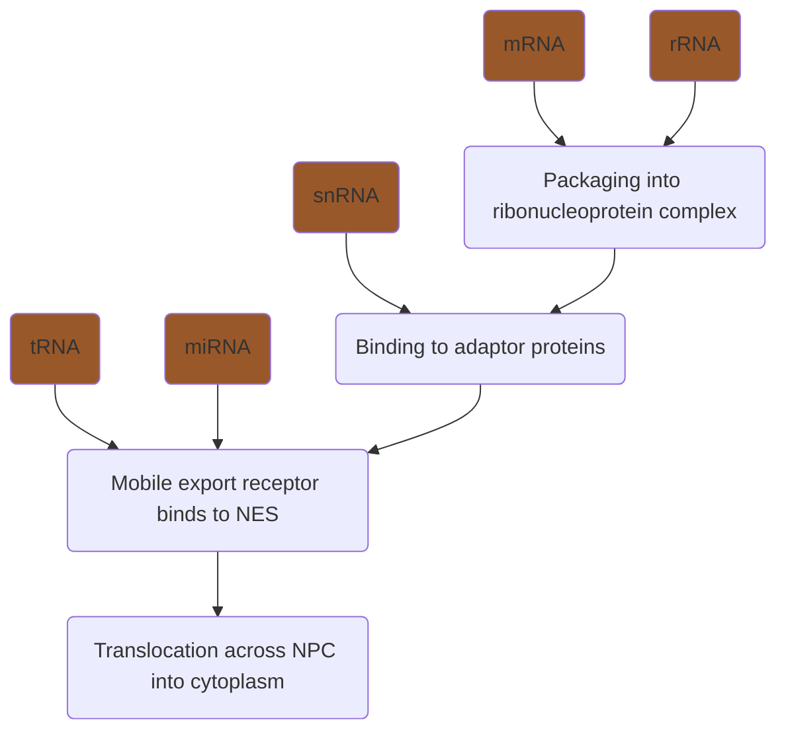

# Questions 
- ==Why do cells localise mRNA to subcellular regions?==
- ==How is RNA localised?== 
	- Discuss the molecular mechanisms that impart directionality to the nuclear export of RNAs of all types, and the cytoplasmic localization of mRNAs.
	- How is the cytoplasmic localisation of an mRNA specified?
	- Compare and contrast the mechanisms of nuclear export of RNAs and of cytoplasmic localization of mRNAs.
- Experimental techniques 
	- *==What methods can be used to detect and quantify mRNA? What would govern your choice?==*
	- You are given a project to study the molecular mechanisms used by two mRNAs to localise to precise regions of the cytoplasm, one in Drosophila eggs, the other in Xenopus eggs. What do you consider to be the key questions to be addressed in this project and ==how would you answer them experimentally?==
		- [[B2 RNA localisation#Key questions about RNA localisation]]
		- Why do they localise? How do they localise (mechanism, kinetics)? When do they localise? Where exactly do they localise? (does this change over time?) Heterogeneity? Regulation? 

# Why do cells localise mRNA? 
- Localisation of mRNA regulates translation in space. In other words, mRNA localisation facilitate protein localisation to subcellular regions 
	- E.g. targeting of different splice variants to cellular compartments and activation of translation only at destination in response to signals 
	- E.g. cotranslate protein products that act together or coassemble 
		- Increase efficiency of assembly 
- It is energy efficient to localise mRNA than proteins, which can be useful for long distance transport (e.g. along axons in neurons)
	- More energy efficient to transport a few mRNA molecules that can each be translated many times on location, than to transport many proteins 
	- #question then why are there sorting/transporting systems for proteins... (module C)
- Prevent ectopic protein activity before reaching appropriate site 
	- Important especially for maternal determinants, as spatially inappropriate expression can disrupt embryonic patterning 
- Nascent proteins may have different properties from pre-existing copies due to post-translational modifications or chaperone-aided folding pathways 
- In some contexts, transport of proteins may be spatially constrained while transport of mRNA is not
	- E.g. In budding yeast, there is a very small conduit between the mother cell and the bud 
- Regulate translation during stress response 

## Biological roles 
mRNA localisation serves to create spatial patterns of gene expression: 
- Asymmetric divisions/cell fate determination: Daughter cell acquires different fate from mother cell 
	- #experimental_evidence *ASH1* mRNA is localised to bud tip and anchored there. Localised translation in bud tip produces ASH1 protein, which inhibits transcription of the homothallic switching (HO) endonuclease, required for mating type switch, hence preventing mating type switching in daugter cell 
	  ![[Pasted image 20221219192543.png|400]]
- Localised signalling: Targeting secretion of a signalling molecule to a specific region of the cell
- Cell polarity: Contribute to the polarisation of the cytoskeleton 
- Cell migration and motility 
	- E.g. In fibroblasts, localised expression of beta actin mRNA results in formation of focal adhesions 
	  ![[Pasted image 20221219193200.png|500]]
- Localised determinants: Localisation and local translation allows the formation of a gradient for patterning during development 
	- E.g. in *Drosophila* blastoderm patterning, *run* RNA is localised to the apical side of blastodermal cells, *stg* RNA is localised to the basal side, and *hunchback* is unlocalised. 
	- E.g. Polarisation of *Wnt3* mRNA in *Clytia* eggs 
	- Developmental biology models are popular for studying RNA localisation because inappropriate RNA localisation results in very obvious phenotypes, making it easier to study 
- Synaptic plasticity 
	- E.g. Removal of 3' UTR of *CAMK2A* mRNA that mediates mRNA localization into dendrites, resulted in 85% loss of dendritic CAMKIIa and deficits in long term potentiation and memory formation 
- Co-translational assembly of supermolecular structures 
	- Generation of high local protein concentrations facilitates their incorporation into maccromolecular structures 
	- Co-translation of different subunits 
	- E.g. some cytoskeletal proteins assemble during translation as nascent peptides, so cotranslational assembly would be facilitated by colocalisation of mRNA. In *Naegleria*, localization of mRNAs encoding microtubule proteins precedes assembly of the basal body upon transition from amoeboid to flagellar state 
- Import of mRNA into organelles, e.g. nucleus, ER, mitochondria 
	- E.g. Yeast *ATM1* mRNA accumulates in proximity of mitochondria, possibly to facilitate co-translational import. It encodes an ABC transporter for the inner mitochondrial membrane. 
- Sorting integral membrane proteins to specific subdomains of cell membrane 
	- E.g. Takizawa et al showed localisation of mRNA encoding ion channel Ist2 to the growing bud of yeast cells for insertion into the bud cell membrane. Diffusion into cell membrane of mother cell is blocked by septins. 

## Examples of localised mRNA
- *Vg1 VLE* (*Xenopus*) 
- *bcd*
- *osk* (*Drosophila*)
- *upd*
- *ASH1* (yeast)

# Nuclear export 
- Different RNA types have different export routes, facilitated by different combinations of proteins 
- Export pathways are increasingly complex from tRNAs,miRNAs → snRNAs → mRNAs 
- Export is coupled to transcription (in yeast) and splicing (in metazoans)

![[Pasted image 20221219184431.png|275]] 

## Packaging of mRNA into RNP complexes 
- Export of RNA is linked to synthesis, processing, and assembly of the a ribonucleoprotein particle (RNP) 
	- Different kinds of RNPs exist, that differ based on the composition of proteins in the RNP:  
		- Polysomes 
		- RNA granules 
		- RNA particles
		- Stress granules 
		- Processing bodies 
		- miRISC 
		![[Pasted image 20221219183145.png|550]]
- mRNA nuclear history is important – nuclear processing events (e.g. splicing, transit through nucleus, translocation through nucleopores, etc.) are required for cytoplasmic targeting of mRNAs 
- Upon export to cytoplasm, these RNP complexes are remodelled and mRNA binds to cytoplasmic factors that repress translation or recruit molecular motors 

## Regulation of export receptors by RanGTP/GDP cycle 
- tRNA, miRNA, snRNA, and rRNA export relies on karyopherin family exportins 
- Karyopherins are regulated by Ran GTPase, which exists in a GTP-bound state in the nucleus and GDP-bound state in the cytoplasm.  ^1f6167
- RanGTP-RanGDP gradient across the nuclear membrane is generated by RanGEF in the nucleus and RanGAP in the cytoplasm 
- Exportins bind nuclear cargo only together with RanGTP, and this ternary complex dissociates in the cytoplasm upon hydrolysis of RanGTP to RanGDP

## tRNA export 
- Exportin-t binds directly to tRNAs in a Ran-GTP dependent manner 
	- Exportin-t recognises NESs in tRNAs, which are coded in secondary and tertiary structural elements and properly processed 5' and 3' termini 
	- Exportin-5 may also serve as an auxiliary receptor 
- When tRNA-exportin-t-RanGTP complex reaches the cytoplasm, RanGAP stimulates GTP hydrolysis on Ran, inducing the release of tRNA cargo 

## miRNA export 
- The initial dsRNA precursor is processed by Drosha to produce a stem-loop intermediate (pre-miRNA)
- Pre-miRNA is exported to the cytoplasm by exportin-5 in a RanGTP-dependent manner
	- The NES recognised by exportin-5 is a double-stranded RNA minihelix with a ~2-nucleotide 3' overhang  in the pre-miRNA, a structure generated by Drosha 
- Upon reaching cytoplasm, RanGTP undergoes hydrolysis, which releases pre-miRNA for further processing to a mature miRNA 

## snRNA export 
- Export of snRNAs required an adaptor protein that recruits the export receptor CRM1/exportin-1 
- The cap-binding complex (CBC) binds to the 5' cap of snRNA 
- Another adaptor protein, PHAX, is phosphorylated in the nucleus, allowing it to recruit CRM1 and RanGTP to the CBC-bound snRNA complex 
	- CRM1 recognises a Leu-rich-type NES in PHAX 
- After export to the cytoplasm, RanGTP undergoes GTP hydrolysis, and PHAX is dephosphorylated, dissociating the export complex to release the snRNA 

## mRNA export 
- tRNAs and miRNAs exhibit common identity elements that can be used for targeting by class-specific export receptors, but mRNAs are much more diverse in length, sequence and structure to use the same method of export 
- mRNAs must first assemble into mRNA ribonuclearprotein particles (mRNPs) by binding to RNA-binding factors 
	- E.g. heterogenous nuclear ribonucleoproteins (hnRNPs)
- Different mRNA transcripts recruit different adaptor proteins 
	- **Yra1 (yeast) or ALY/REF (metazoa)** interact with Sub2(yeast)/UAP56(metazoa) which are RNA helicases that associate with several complexes involved in mnRNP biogenesis, and also interact directly with the general mRNA exporter, thus linking mnRNP biogenesis and export 
	- **SR (Ser/Arg-rich) proteins (splicing coupling):** After splicing, several SR proteins remain bound to the spliced transcript to recruit the general export receptor, which binds directly to SR motifs. During splicing, these SR motifs are hyperphosphroylated, but become hyophosphorylated afterwards, which favours general export receptor binding. 
		- In yeast, the phosphorylation state of the SR protein Npl3 may impart directionality on export. Npl3 is phosphorylated by Sky1 kinase in the cytoplasm, stimulating its import into the nucleus. In the nucleus, Npl3 can associate with the mRNA transcript, and is then dephosphorylated by nuclear phosphatase Glc7, which allows it to interact with the general export receptor Mex67-Mtr2. Once mRNP is transported to the cytoplasm, Npl3 is rephosphorylated to dissociate the export complex and releasing the mRNA.  ^7ddaa6
	- **TREX:** Recruited by capping and splicing factors. TREX is made up of several factors, including ALY/REF (metazoans), and the THO complex. In *S. cerevisiae*, THO complex associates with nascent mRNA during transcription, which then recruits the remaining TREX-complex components. In higher eukaryotes, TREX recruitment is more linked to splicing and/or capping rather than transcription. 
		- To recruit the general export receptor, ATP-bound Sub2/UAP56 recruits Yra1/ALY to mRNP, ATP hydrolysis of UAP56 triggers mRNA transfer to ALY, general export receptor binds to ALY 
- General mRNA export receptors **Mex67-Mtr2 complex in yeast** and **TAP-p15 complex in metazoans** transport mRNPs + adaptor proteins out 
- **Two mRNA export factors at the NPCs impart directionality** for mRNA export in *S. cerevisiae* ^58bc77
	- **Dbp5**, an RNA-dependent ATPase, binds to the NPC cytoplasmic surface by interacting with NPC protein Nup214
	- **Gle1** binds to NPC cytoplasmic surface by binding to IP6 and docking to neighbouring NPC protein hCG1 
	- As an **mRNP** reaches the cytoplasmic side of the NPC, it **associates with Gle1 and Dbp5**
	- **Gle1 stimulates ATPase activity of Dbp5** to convert it from Dbp5ATP to Dbp5ADP, and this conformational change **triggers removal of some proteins from mnRNP**, including general export receptor Mex67 and polyA-binding protein Nab2 
- For some **transcripts that contain AU-rich elements (AREs) in their 3' UTR**, **CRM1 may act as the export receptor** e.g. some protooncogenes, cytokines 
	- AREs can target NES-containing adaptor proteins to connect to CRM1 (exportin-1, used by snRNAs) export pathway 
	- Possible adaptors – HuR (*Cd83, Fos mRNA*), eIF4E (*cyclin D1 mRNA*)

### Links to splicing 
- ALY/REF, UAP56 and TAP-p15 can associate with the exon-junction complex 
- E.g. *oskar* mRNA relies on exon-exon junction complex for localisation to the posterior of *Drosophila* embryos 
	- #experimental_evidence Hachet & Ephrussi (2004) showed that in EJC mutants, there was inappropriate localisation of *oskar*. 

## rRNA export 
- Mechanism for export of pre-40S particle is unclear, but it is known that Ran cycle and Crm1 play a role. Not sure what adaptor(s) are 
- For pre-60s particle, export depends on RanGTP-GDP system and Crm1 export receptor, with Nmd3 as the adaptor protein 
	- Mex67-Mtr2 may be used as an additional export receptor, using a distinct binding site 
	- Arx1 may act as an export factor that is recruited to the pre-60S particle with Nmd3 and Mex67-Mtr2. After nuclear export, Arx1 and interacting partner Alb1 are released from 60S by Rei1 in the cytoplasm 
	- As pre-60S particle is so bulky, it may need to rely on several export receptors for efficient transport to the cytoplasm 

## Docking to and passage through NPC 
- Export receptors (both karyopherin receptors and mRNA general export receptors) docks at NPC by interacting with a class of NPC proteins, FG-Nups, containing FG-rich regions 
- For some mRNAs, positioning of respective chromatin region near NPC may facilitate export ("gene gating")

## Directionality
- For tRNAs, miRNAs, snRNAs, rRNAs, directionality is established by the RanGTP-GDP cycle 
- In mRNA, directionality is established by multiple mechanisms 
	- Phosphorylation state of adaptor proteins (see [[B2 RNA localisation#^7ddaa6|Npl3]])
	- ATP/ADP state of Dbp5 (see [[B2 RNA localisation#^58bc77]])

# Mechanisms for mRNA localisation 
Note that mRNA species can be transported by more than 1 mechanism! 
- E.g. *nos* mRNA distributed to posterior of *Drosophila* oocyte via both local protection and active transport processes 

## Local protection from degradation 
![[Pasted image 20221219184942.png|300]]

- E.g. In *Drosophila* oocyte, *Hsp83* mRNAs are evenly distributed throughout the cytoplasm, and after fertilisation the mRNAs are degraded, except for the mRNAs at the posterior cytoplasm, resulting in localisation. 
- E.g. *Drosophila* *nanos* is localised to posterior of embryo by several mechanisms, including by local stabilisation by Oskar which prevents Smaug, a degradation factor, from binding to Smaug-responsive elements in the 3' UTR 

## Facilitated diffusion with local entrapment 
![[Pasted image 20221219184959.png|300]]

- mRNA localisation may occur by partially or entirely by spatially selective mRNA capturing
- Often, the mRNA is anchored to actin 
	- E.g. In *Xenopus* oocytes, *vg1* localisation depends on actin-based anchoring at vegetal cortex 
	- E.g. "In Drosophila melanogaster oocytes, cytoplasmic streaming from the nurse cells at the anterior drives *nanos* mRNA to the posterior, where it is anchored to actin and translated"
	- E.g. in yeast, *ASH1* mRNA anchors at cortex at tip of bud, requiring function of Bni1 and Bud6, proteins of cortical actin cytoskeleton 
- Alternatively, motors may dock mRNAs after transporting them 
	- E.g. In *Drosophila* blastoderms, dynein anchors *fushi tarazu* mRNA 
- Or, RNA-binding proteins 
	- E.g. Staufen is a dsRNA binding protein that anchors *bcd* mRNA in the anterior cytoplasm of *Drosophila* eggs 
- Or, RNAs 
	- E.g. In *Xenopus*, short untranslated RNAs called *Xlsirt* RNAs anchor *Vg1* mRNA at the cell cortex at vegetal pole of oocytes. *Xlsirts* contain stretches complementary to *Vg1*. 

## Directed transport along a polarised cytoskeleton by motor proteins 
#comment Link this to C3 Organelle movement? 

![[Pasted image 20221219185018.png|425]]

- Motor proteins allow for rapid transport of mRNA
- ACTIVE process – requires ATP 
- mRNA cannot bind to motor proteins directly, and have to bind to a combination of RBPs (and possibly adaptors) first 
	- E.g. *ASH1* mRNA in *S. cerevisiae* binds to RBP She2, which recruits it to myosin motor protein 4 (Myo4) via an adaptor protein, She3. This "locasome" complex then transports the mRNA along the actin cytoskeleton to the bud tip. In the cytoplasm, RBPs Khd1 and Puf6 repress translation of *ASH1* mRNA until it reaches the bud tip. Puf6 does this by binding to eIF5B 
- After transport, anchoring occurs to block further diffusion of the localised transcript 
	- This can rely on cortical actin and actin-binding proteins, or other actin-independent anchors (see [[B2 RNA localisation#Facilitated diffusion with local entrapment|Facilitated diffusion with local entrapment]])
	- If there is no static pre-localised anchor, anchoring can occur via continuous rounds of short-range active transport 
		- E.g. *bicoid* mRNA at anterior pole of late-stage *Drosophila* oocytes 
- However, attachment to a motor alone will not inherently localise mRNAs, there are additional regulatory mechanisms to impose directionality on transport 
	- "Uniformly distributed transcripts also undergo cytoskeleton-dependent movement", but the difference is that localised mRNA undergo non-random movement 
	- #experimental_evidence *LacZ* mRNA from *E. coli* expressed in mammalian cells has no known localisation elements, and yet exhibits low levels of active transport (Fusco et al 2003)
	- #experimental_evidence *ASH1* mRNA retains a low probability of associating with a myosin motor even when its "zip code" is deleted (Sladewski et al 2013)
	- E.g. Apical localisation of wingless and pair-rule RNPs in *Drosophila* blastoderm embryos is mediated by dynein along microtubules 
		- #experimental_evidence Wilkie & Davis (2001) used in-situ hybridisation in fixed embryos as well as time-lapsed imaging of fluorescently tagged RNA to observe the movement of these transcripts 
- Bidirectional transport is common in higher eukaryotes, possibly allowing RNPs to navigate around obstacles or to fine-tune directional transport 

### Mechanisms to regulate directionality 
- Differential binding of RBPs and motor proteins to mRNAs, since microtubules and actin filaments are polarised 
	- Different motor proteins move towards different poles of microtubules, and can be unidirectional or bidirectional 
	- Combinatorial binding of different motor proteins to a single RNP should produce a net directionality 
	  ![[Pasted image 20221220200444.png|600]]
	- E.g. mRNAs localised to apical cytoplasm of blastoderms in *Drosophila* are biased towards minus end-directed movement on microtubules due to binding to Bicaudal D and Egalitarian RBPs that bind to dynein 
- Non-random distribution of microtubule polarity in the cell 
	- E.g. localisation of *oskar* mRNA to posterior of *D. melanogaster* oocytes is due to biased microtubule polarity 
	- E.g distribution of mRNAs to vegetal cortex in *Xenopus* is due to microtubule polarity being biased, with more plus ends positioned at vegetal cortex 

### Mechanisms to regulate motor dynamics 
- Microtubule-associated proteins can alter microtubule binding and dissociation kinetics, motility properties of motor proteins
	- Increasing reversals in direction 
	- Act as obstacles
- Adaptor proteins can active or alter motor activity 
- Nature of motor protein can affect which cytoskeletal track (actin filaments or microtubules) and properties of movement as well (e.g. speed, processivity) 
- Number of motor proteins 
	- E.g. E.g. *ASH1* in yeast has 4 localisation sequences that can bind to 4 She3 RBPs and in turn 4 myosins for increased transport processivity along actin filaments 
- Binding of cargoes to motors can also alter their binding and motility on microtubules, as well as increasing processivity 

## Transport of mRNA species in different tissues 
- A single mRNA species may be transported via different mechanisms in different tissues
	- E.g. β-actin mRNA in glia cells is diffusive, while in neuronal dendrites, it is static or motored 
	- E.g. *Nanos* mRNA localises to posterior pole of *Drosophila* embryos via diffusion and entrapment, while in larval neurons it is transported via dynein motors 

# How is mRNA localisation regulated? 
## Cis-acting elements
Fusing cis-acting elements to other proteins results in localisation to the same area. 

### Classes of cis acting elements 
- May be short segments with a defined nucleotide sequence
- Repeated short signals 
	- E.g. β-actin has a bipartite motif in the 3' UTR that is recognised by ZBP1 for localisation in fibroblasts
- Some signals within mRNA may form secondary structures (e.g. stem loops) that act as binding sites for proteins  ^0ac89e
	- E.g. 3' UTR of *bicoid* has several *bicoid* localisation elements that form stem loop stcutrues that form intermolecular interactions. Dimerisation of stem loops and association with Staufen are required for *bicoid* transport 
- Certain cis-acting elements mediate local stability of the mRNA
	- E.g. *nanos* is localised at posterior pole. Oskar stabilises the transcript at the posterior pole by preventing degradation factor Smaug from binding to Smaug-responsive elements in 3' UTR 
- Generally, zipcodes have been difficult to identify due to the difficulty of predicting RNA tertiary structures *in silico* and that localised mRNAs can contain multiple localising elements that are redundant or complementary 

![[Pasted image 20221220194850.png|300]]

### Where zip codes can be found 
- Many eukaryotic mRNAs contain a "zip code" in the 3'UTR, and their function is mediated by mRNA binding poteins 
- Other mRNAs have zip codes in the 5' UTR 
- Zip codes in coding regions 
	- E.g. *Drosophila Grk* mRNA has zip codes dispersed throughout the transcript. Region in the 5' UTR is needed for initial localisation steps, while 3' UTR signal is involved in later localisation, and final accumulation of *grk* relies on signal within coding region that protects or anchors mRNA
	- E.g. One of two yeast *ATM1* signals is in 5' most part of coding sequence 
- Zip codes in membrane targeting regions 
	- Signal for prokaryotic *bglG-bglF-bglB* mRNA is encoded in sequence for first two transmembrane helices of bglF, which is a uracil-rich region similar to various transmembrane proteins, which suggests that a membrane-targeting mechanism may be used for localisation of this mRNA 
- Some mRNA may have multiple localisation signals that are used at different points in time for stepwise localisation 
	- E.g. *bicoid* mRNA has three signals used for 1) Early localisation, 2) Early and late localisation, and 3) RNA anchoring 
	- E.g. *Xenopus Xcat2* also has modular localisation signals in 3' UTR. It is first targeted to the mitochondrial cloud of the oocyte using an early localisation element, and within the cloud, *Xcat2* localises to germinal granules using a second signal. 
- #experimental_evidence Deletion analysis – removal of loops to check effect on protein binding and localisation 

## Trans-acting proteins 
- Three main classes 
	- hnRNP-like proteins with RRM domains e.g. hnRNP2 A2 (binds to *MBP*)
	- ZBP-1-like proteins with RRMs and KH domains e.g. ZBP-1
		- ZBP-1 recognises β-actin localisation element in chicken fibroblasts 
		- *Xenopus* Vg1RBP recognises *Vg1* mRNA zip cde 
	- ds mRNA-binding proteins with dsRBD motifs e.g. Staufen (binds to *osk, pros*)
- Some don't fit into the three main classes
	- She2 – binds to stem-loop containing zip codes of yeast *ASH1* mRNA 
- Initial assembly of mRNA-localisation machinery on the zip code may begin in the nucleus, and cytoplasmic machinery may recognise a localised mRNA only when bound to partner proteins from nucleus 
	- E.g. hnRNP A2 binds to *MBP* mRNA in oligodendrocytes and accompanies it to cell extensions 
	- E.g. ZBP-1 and *Xenopus* homologue Vera both contain nuclear export signals, so they may shuttle between nucleus and cytoplasm 
- Some zip codes may be recognised by a complex of trans-acting proteins 
	- E.g. Egalitarian only has modest binding preference for targets, but interaction with BicD protein enhances affinity for mRNA targets 

## Translational regulation during transport 
- mRNAs must be translationally repressed during transport to ensure localised translation 
- Translational repressors associate with transport RNPs by binding directly to RNA regulatory sequences, largely at initiation stage 
	- E.g. In the cytoplasm, RBPs Khd1 and Puf6 repress translation of *ASH1* mRNA until it reaches the bud tip. Puf6 does this by binding to eIF5B 
- Phosphorylation of repressors at destination decreases their affinity to target mRNAs, thus derepressing translation 
	- E.g. Zbp1 acts as a repressor that lifts repression upon phosphorylation 

## Phase separation   
- mRNA secondary structure can affect which condensates they localise to 
	- #experimental_evidence In multinucleate cells of the fungus *Ashbya gossypii*, Whi3 RBP can undergo LLPS with different target mRNAs. mRNA targets of the Whi3 RBP can base pair to colocalise in condensates, however secondary structure determines which complementary sequences are accessible. *BNI1* and *SPA2* can interact as their complementary sequences are exposed, while *CLN3* and *BNI1* cannot interact as their complementary sequences are in hidden within secondary structures ![[Pasted image 20230518223548.png|500]]
- *oskar* RNPs can form solid-like granules which are transport-competent, but the solid state prevents RNA entry into the condensate. Artificial inducement of a liquid-like state reduced localisation efficiency of *oskar*, but the liquid state allows for RNA incorporation (Bose et al 2022)
- In *A. gossypi*, *BNI1* and *SPA2* mRNA are localised into RNP droplets at growing tip to maintain polarity of hyphae tip 

# Key questions about RNA localisation 
- Why is the mRNA localised? What is the biological function (e.g. in development)?
- What is the cis localisation element/zip code that directs localisation? 
- What proteins are incorporated into the mRNP? What are their functions? 
- What trans acting factors direct localisation (in the nucleus and in the cytoplasm)?
	- Are there homologies between the factors used in *Drosophila* and *Xenopus*? 
- By what mechanism is the mRNA localised in the cytoplasm? Is it just one or several? 
- What regulates transport of the mRNA? What proteins are involved? 
- How is localisation maintained? 
- How is translational repression maintained during transport? 

# Techniques for detecting mRNA 
## In-situ hybridisation methods 
- A large suite of mRNA detection techniques rely on the hybridisation of an oligonucleotide probe to a target mRNA in the cell via complementary base pairing. The basic premise of these techniques is that each probe binds to a target mRNA sequence in a 1:1 fashion, while the probe itself is linked to some detectable substance (e.g. a fluorophore, gold nanoparticles) for quantification.
- Despite their lower sensitivity compared to RT-qPCR or RNA-seq, in-situ hybridisation methods are particularly useful for studying RNA localisation since the location of the oligonucleotide probes can be detected via microscopy. Depending on the type of sample, speed of the process being observed, and the level of sensitivity required, different microscopy techniques can be used (e.g. wide-field microscopy, confocal microscopy, etc.)

### Fluorescent in-situ hybridisation *FISH*
- Links probe hybridisation to the level of fluorescence measured
- Can be used to visualise the positions of mRNA in a variety of samples, including cell cultures and tissue sections. The probe is conjugated to a fluorophore such that fluorescence can be detected via fluorescence microscopy at any position where the probe hybridises
- Multiplexing is possible by conjugating each RNA probe to a different fluorophore.
- amount of mRNA is quantified by measuring the fluorescence signal intensity in the sample, and comparing it to the fluorescence intensity of a known concentration of oligo in vitro
- As applications tend to suffer from high background fluorescence and non-specific binding, some variants of FISH have been developed to improve the signal to noise ratio and thus improve the accuracy of quantification
	- **Single molecule FISH (smFISH)** uses multiple short DNA probes conjugated to the same fluorophore and that are complementary to different regions of the target mRNA sequence. Since multiple mis-bound probes are unlikely to co-localise, this reduces the false positive signal. The number of mRNA can then be quantified by counting the number of fluorescent spots within a single region.
		- E.g. #experimental_evidence Nishimura et al (2015) used smFISH to track changes in mRNA abundance across the C. elegans embryo for three genes, chs-1, pgl-1, and bpl-1.
	- **Molecular beacons**: Small hairpin-shaped oligonucleotides with an internally quenched fluorophore, which only fluoresces when the beacon hybridizes to its target sequence. An even more sophisticated version combines molecular beacons with **FRET**, which requires co-localisation of two molecular beacons at adjacent regions on the same mRNA for fluorescence to be detected
		- E.g. #experimental_evidence Santangelo et al (2004) used this method to localize Kras mRNA in human dermal fibroblasts with high signal to background ratio.

### Immuno-electron microscopy 
- For studying mRNA localisation at even smaller scales
- In general, the method involves the use of an antisense probe conjugated to digoxigenin or biotin. Following hybridisation, a primary antibody is introduced that binds to the probe label, then a secondary antibody conjugated to a gold nanoparticle is used, which binds to the primary antibody. These gold nanoparticles then show up as dark spots on an electron micrograph
- E.g. #experimental_evidence Delanoue et al (2007) used this method in ultrathin cryo-sections to follow grk mRNA localisation in the Drosophila oocyte.
![[Pasted image 20221220175311.png|475]]

### Nuclease protection assay 
- Hybridisation of an antisense probe to an RNA sample, then degrade unhybridised RNA (mRNA and probe) with nucleases, and separate remaining protected fragments on acrylamide gel 
- Multiplex by using multiple probes 
- Assay does not provide information on transcript size, as the portion of probe homologous to the target RNA determines the size of the protected fragment 
- Also prior knowledge of mRNA sequence is required – the antisense probe typically has to be completely homologous to target RNA to prevent cleavage by the nucleus, so cross-species sequences cannot be used 

## Protein binding methods 
Apart from using oligonucleotide probes for detection of mRNA, RNA binding proteins can also be used to localize and quantify mRNA. 

### MS2-MCP system 
- Uses MS2 RNA coat protein (MCP) fused to a fluorescent protein
- Gene that produces the target mRNA has to be genetically modified to encode MS2 stem-loop motifs to allow for binding of the MCP fusion protein
- For multiplexing, similar stem loop-binding systems have been developed so that multiple mRNAs can be tracked at once. These include the U1A RNA binding system, lambda box B-peptide N system, or human Pumilio system. Different mRNA sequences can then be engineered to include different stem loops.
- Apart from visualising RNA localisation, other applications for MS2-like systems include 
	- Nascent chain tracking: design a fusion protein gene with MS2 stem loops. Upon transcription, the mRNA will contain MS2 stem loops for visualisation, and upon translation, the protein will be fused to epitope tags for visualisation of the protein, such that both mRNA and protein of the gene can be localised at once 
	  ![[Pasted image 20221220180413.png|475]]
	- Affinity purification: MCP is fused to a unique epitope (e.g. streptavidin binding protein) to pull down using streptavidin and biotin beads 
	- Dual colour labelling: two mRNAs or two different parts of the same mRNA are tagged by different stem loop RNA binding protein-fluorescent protein systems 
	- Background free imaging: To reduce background fluorescence, two different MS2-like systems are used, with each system fused to one half of a split yellow fluorescent protein 
	- Artificial localisation of mRNAs to subcellular sites to rescue mRNA localisation defects 
	- Tethering proteins to mRNA: By fusing MCP to a protein with a specific subcellular localisation 
![[Pasted image 20221220194121.png|500]]

### CRISPR-Cas13
- Gootenberg et al (2017) presented the first such Cas13-based detection system, known as SHERLOCK, to genotype nucleic acid sequences from various sources. The technique relies on the fact that Cas13a can be reprogrammed with CRISPR RNAs that are complementary to particular target sequences, and upon binding to the target sequence will cleave non-target RNA. In SHERLOCK, any RNA present undergoes an isothermal amplification step, then Cas13a detects the target RNA, upon which it cleaves a reporter RNA that releases a fluorescent signal upon degradation. This system was able to detect single stranded RNA with attomolar sensitivity, which is comparable to qPCR
- Shinoda et al (2021) subsequently created a SHERLOCK variant called SATORI that can be used for RNA detection. It has femtomolar sensitivity but removes the amplification step, thus increasing the speed of detection. In theory, calibration for the fluorescent signal could allow for RNA quantification as well, although this has not been explored

## RNA injection 
- Inject *in vitro* transcribed RNA that is attached to fluorophores into the cell, and monitor localisation 
- However if the RNA is synthesised in vitro, there may not be *in vivo* processing of the RNA, and injection may also cause damage to the cell. 

## RNA aptamer binding  
- Similar to protein binding methods, except in place of a protein, a fluorogenic RNA aptamer is used, e.g. Spinach, Pepper, Mango 
- RNA aptamers induce fluorescence by binding a fluorogenic dye. There is also a binding platform that hybridises with the target RNA. 
	- Fluorogenic dyes can be brighter than a fluorescent protein 
	- - However, delivery of non-genetically encoded labels (in the form of a dye) may be detrimental to the cell and introduce background fluorescence 
- Not all RNA aptamers are suitable for single molecule imaging, but Cawte et al (2020) developed Mango II aptamers for single molecule resolution imaging of RNA localisation 

![[Pasted image 20221220181416.png|375]]

## Amplification methods 
While highly accurate and sensitive, PCR-based methods do suffer from lower speed and possible risk of contamination if used by an untrained operator. As such, these methods may not be suitable for monitoring the changes in gene expression of mRNA with short half-lives, or for monitoring highly dynamic processes.

### Reverse transcription-quantitative PCR (RT-qPCR)
- Current gold standard for RNA quantification in terms of sensitivity and accuracy
- involves the reverse transcription of the RNA to DNA, followed by a qPCR step to quantify the amount of RNA present
- For total mRNA quantification in eukaryotes, oligo dTs can be used as primers for reverse transcription as they anneal to the polyA tail. Alternatively, random hexamers can be used
- For quantification of specific mRNA sequences, a specific primer can be employed instead
- In the quantification step, PCR amplification of the DNA in the presence of an intercalating dye (e.g. SYBR Green) or a fluorescent oligonucleotide probe allows for determination of the starting quantity of DNA, and in turn RNA. This is based on calculation of the Ct value, which refers to the number of PCR cycles required to generate fluorescence above a particular threshold.

### Digital droplet PCR (ddPCR)
- involves partitioning the PCR reaction plus fluorescent probes into many small droplets, then after a certain number of amplification cycles, each droplet is checked for fluorescence (above a threshold). The fraction of droplets with fluorescence then correlates to the initial amount of RNA.

### Reverse transcriptional loop-mediated isothermal amplification (RT-LAMP)
- Unlike the above PCR-based methods, RT-LAMP is a rapid amplification method that has been used as a detection method for SARS-CoV-19 and other influenza virus RNA 
	- E.g. #experimental_evidence Ahn et al (2019) developed a multiplex RT-LAMP diagnostic platform for detecting different seasonal and avian influenza viruses that is rapid and sensitive (91 samples confirmed by qRT-PCR were also detected by this platform with 98.9% agreement)
- Following RT of RNA to cDNA, LAMP amplifies the target cDNA sequence at a constant temperature of 60-65°C. 
	- 4-6 primers are needed: forward inner primer, backward inner primer, forward outer primer, backward outer primer, and 2 loop primers (optional but improves amplification efficiency)
	- Process (adapted from [https://www.youtube.com/watch?v=UJE9SBMrh20](Henrik's Lab))
	  ![[Pasted image 20221220175011.png|425]]
- The advantage of RT-LAMP is that it is rapid and can be carried out a constant temperature (i.e. isothermally)

## Global mRNA profiling method 
The previously described methods allow for detection and/or quantification of specific target mRNA. While multiplex variants of some of these techniques exist, they would be impractical if we wish to study changes in quantity of hundreds of target mRNA sequences at a global scale. 

### Microarrays
- mainly used for relative quantification of mRNA from two different samples
- Also involve hybridisation of RNA to oligonucleotide probes, but  the difference with other hybridisation-based methods is that microarrays contain a collection of DNA oligos that are complementary to many different mRNA sequences
- With microarrays, the mRNA has to be reverse transcribed to cDNA, and cDNA from each sample tagged with a different fluorophore to allow them to be differentiated. Then the cDNA is hybridized to the DNA in the microarray, and the fluorescence intensity from each fluorophore is measured to quantify the quantity of each mRNA.
- This allows for the generation of an expression profile, where changes in mRNA quantity can be observed across many genes at once.

### RNA-seq
- Becoming more common as next generation sequencing techniques become cheaper and faster 
- Compared to microarrays, RNA-seq has the advantage of being more sensitive to differences in mRNA quantity, a greater dynamic range, and does not require prior knowledge of the species’ genome, as it does not involve the use of oligonucleotide probes for RNA detection.
- quantification is done by counting the number of mRNA sequence reads that map back to each gene in the reference genome. If no reference genome exists, the sequence reads have to be assembled into longer contigs to generate a reference genome
- E.g. #experimental_evidence Nagalakshmi et al (2008) developed RNA-seq to generate a transcriptomic map of the yeast genome.

## Deciding on a method 
- Accuracy and sensitivity 
- Cost 
- Speed
- Spatial scale 
- Multiplexing 
- **Research question** – what information would be sufficient to answer the question at hand, using minimal time and resources?
	- Detection of mRNA without quantification – Cas13-based methods 
	- Questions on spatial organisation of mRNA – imaging techniques that tag the mRNA with a visible marker, as it would allow for visualisation of positions of mRNA in the cell, e.g. FISH, immuno-electron microscopy, MS2-MCP (depending on spatial scale required)
	- Questions on temporal changes in mRNA – RT-qPCR (high accuracy, low speed)
		- How sensitive does the method have to be? Sensitive methods are often more difficult and slow to use. If mRNA levels exhibit large fold changes over time, then it would be sufficient to use e.g. a hybridisation method which is faster and will still indicate significant changes in mRNA quantity
	- Questions on dynamic changes in mRNA levels – unviable to use slower methods if change in mRNA level occurs too rapidly, e.g. if mRNA has short-half-life. Unless a separate technique is used to preserve the quantity of mRNA at a particular point in time. Protein binding methods are generally suitable. 
	- Following multiple mRNA sequences at once – use multiple technique 
	- More exploratory questions, e.g. "What changes in gene expression drive the development of colorectal cancer?" – use a global mRNA profiling technique to avoid limiting the scope of the study by focusing on particular genes 
	- Questions that require prior knowledge of the particular mRNA sequence e.g. "How does *ASH1* mRNA localise in yeast cells over the course of the cell cycle?" – Can use methods that rely on complementary oligo probes or primers 