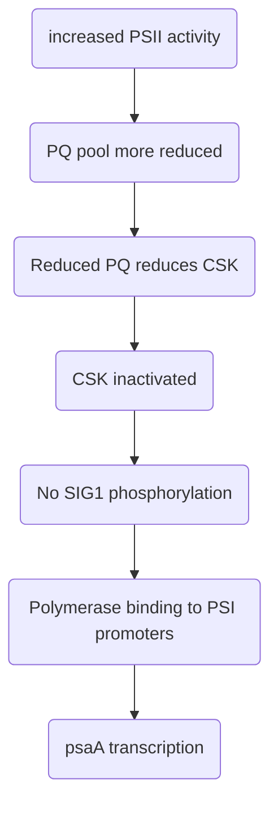

# Questions
- Gene expression and regulation of gene expression in organelles 
	- Compare and contrast transcription in mitochondria and chloroplasts
	- Discuss the importance of post-transcriptional processes in the expression of chloroplast genomes.
	- ==The expression of the chloroplast genome is influenced both by the nucleus and by the metabolic status of the chloroplast. How true is this statement? Justify your answer with examples.==
		- By the nucleus 
			- Nuclear factors regulate mRNA turnover of cp genes 
		- Metabolic status
			- Redox poise
			- ADP levels → post-translational modification
			- Epistasy of synthesis  
			- Efficiency of assembly of oxidative phosphorylation complex assembly (Ott 2016, 120) 
	- ==How does the nucleus influence mitochondrial gene expression and mitochondrial function?==
- Mechanisms of coordinating gene expression in the nucleus and in chloroplasts/mitochondria 
	- ==Discuss the mechanisms that coordinate gene expression between mitochondria/chloroplasts and the nucleus/nuclear genes encoding chloroplast/mitochondrial genes==.
		- Anterograde and retrograde pathways 
		- Disadvantages and why cells separate the genes and do this coordination anyway 
	- Describe the proposed pathways for retrograde signalling by the mitochondrion and by the chloroplast to the nucleus.
- Retention of genes in organelles 
	-  Why are some genes retained in chloroplast genomes?
	- Discuss the proposal that the only reason organelle genomes are retained is to allow redox regulation of gene expression.
	- ==Why do organelle genomes persist?==
- Transfer of genes from organelle to nucleus
	- ==If a gene were transferred from an organelle to the nucleus, what modifications of the gene would be needed to make the gene and its products functional?==
- The mitochondrial genomes of different organisms show a much greater diversity than chloroplast genomes. Discuss the validity of this statement.

# Organelle properties 
## Mitochondria  
### Gene content 
- Human mitochondrial genome encodes: 
	- 12s rRNA
	- 16s rRNA 
	- tRNAs
	- Subunits of NADH dehydrogenase 
	- Subunits of cyt*bc* complex
	- Subunits of cytochrome oxidase 
	- Subunits of ATP synthase 
- Animal mtDNAs may have loss of tRNAs
- Yeast (fungal) gene content is broadly similar to animals. 
- Tobacco mtDNA encodes
	- Ribosomal proteins
	- Complex I-IV of electron transport chain 
	- ATP synthase 
	- Cyt c biogenesis enzymes
	- Tat pathway proteins
	- Intronic ORF 
	- rRNAs
	- tRNAs
- In the green alga *Polytomella magna*, there is palindromic duplication of each gene, and 1 member of each protein gene pair is a pseudogene with no start/stop codons. 
- Changes to genetic code 
	- Humans: e.g. AGA, AGG = STOP, AUA = Met, UGA = Trp 
	- Animals: Others 
- Plasmodium – 3 protein genes, fragmented rRNAs
- Reclinomonas – 65 protein genes, 3 rRNAs, tRNAs, bacterial type RNA polymerase
- *Andalucia* – 66 protein genes, rRNAs, tRNAs 

### Genome size 

> [!WARNING] Note
> Coding content does NOT reflect genome size. 
> 
> Large genomes are not largely different in coding content, and may be padded by:
> - Promiscuous sequences 
> - Non-coding sequences 
> - Expansions of repeats, introns
> - Sequences of possibly viral and bacterial origin

- Humans – 16.6 kbp 
- Animals/fungi have modest variation in size/gene content. 
- In plants, plant mt genome varies widely from 187 kbp (*Marchantia polymorpha*) to 7 Mbp (*Silene*)
	- Comparing plants with fungi/mammals, though there is a 100-fold range in mt genome size, there is only a few-fold range in gene content 
- *Plasmodium* – 6 kbp 
- *Reclinomonas* – 69 kbp 
- *Andalucia* – 68 kbp 

### Genome structure 
- Circular, in humans
- Circular, subgenomic circles or linear genomes also found in animals
- Circularity of genomes in yeast (fungi) has been questioned. See 
	- mtDNA replication in _C. albicans_ involves no circular DNA forms and recombination-driven replication (RDR) is the major or only means of mtDNA replication
	- strand displacement (SD) synthesis data previously used to support a rolling-circle replication (RCR) model for _Schizosaccharomyces pombe_ are in fact compatible with a linear genome and RDR
	- For wild-type _S. cerevisiae_, the minor amount of circular mtDNA of various sizes derive from _petite_ mutants that occur spontaneously in one to several percent of the cells; most mtDNA is in linear and branched forms
- In plants, mt genome is very complex e.g. Maize has 570 kbp genome fragmented into many different smaller molecules, due to the master molecule being surrounded by repeat regions that are recombinationally active 
- Some trypanosomes have mt genomes organised into **maxicircles** and **minicircles**, e.g. *Crithidia fasciculata*
	- There are ~25 maxicircles (~39 kbp each) that encode rRNA, and components of ETC. 
	- There are ~5000 minicircles (~2.5 kbp each) that encode guide RNAs that edit the maxicircles 
	- Maxicircle editing relies on genes encoded by minicircles. 
	- These maxi- and minicircles form physical networks that may help with segregation at division 

## Mitochondrial variants
- **Hydrogenosomes**. anaerobic, energy-producing mitochondria
	- Incomplete mt genome 
		- E.g. *Nyctotherus ovalis*
	- No mt genome 
- **Mitosomes**. Remnant mt with no energy-producing function and no genome. Function in Fe-S cluster biogenesis 
	- E.g. *Giardia*
- **No mitochondria**.
	- *Monocercomonoides* likely acquired a novel pathway for Fe-S cluster biogenesis that could function in the cytosol 

## Chloroplasts
### Genome size 
- Land plants – 120-160 kbp 
- Algae – Wider than land plants, can be 64kbp (*Prasinophyceae* sp CCMP2105) to 1.35 Mbp (*Haematococcus lacustris*)

### Genome content 
- Size difference not reflected in numbers of protein genes 
- Land plants – typically encode components of 
	- PSI and PSII 
	- Cytbf complex
	- ATP synthase
	- Protein synthesis 
	- Ribulose bis-phosphate carboxylase
	- rRNAs, tRNAs
	- Promiscuous DNA is rare. 
- Algae – *Prasinophyceae* sp CCMP2105 has 100 protein genes, vs *Haematococcus lacustris* which has 125 protein genes 
	-  Large *H lacustris* genome size is due to proliferation of mostly palindromic repeats. There are 139k repeats in 34.7k families, with 5-270 copies of repeats. Many repeats are nearly identical to those in the mitochondrion, and the repeats may have spread from the chloroplast to mt. 
		- #question How did they spread? 

### Genome structure 
#### Photosynthetic organisms 
- Land plants 
	- Inverted repeat separates the small single copy region from the large single copy region 
	  ![[Pasted image 20230327181057.png|200]]
	- IR is lacking in conifers, some legumes 
	- Size variations in land plants often due to changes in extent of the IR – e.g. in *Pelargonium*, the IR is 75 kbp (cf typically 20-28 kbp in other plants)
	- Gene order is generally related by a small number of rearrangements, but multiple rearrangements observed in conifers, some legumes
- Dinoflagellates 
	- *Amphidinium carterae*
		- Chloroplast genes are retained on coding minicircles, typically containing 1 or sometimes more genes 
		- Minicircles have conserved "core" regions 
		- Some minicircles are empty
		- Also presence of microcircles (even smaller) that are also empty 
		- Transcripts get 3' polyU tails 
	- *Boodlea composita* has a reduced and fragmented chloroplast genome, and genes appear to be on hairpin molecules
		- Some cp transcripts receive 3' poly U tails 

#### Non-photosynthetic organisms 
- Mt genomes of human head louse (*Pediculus capitis*) and human public louse (*Pthirus pubis*) are organised similarly to dinoflagellate cp genomes 
- Retention of chloroplast DNA for other functions e.g. fatty acid biosynthesis ([[C5 Lipid metabolism in plants]]), haem production 
	- e.g. *Epifagus* has lost all bioenergetic genes and pseudogenes, retaining gene expression genes (*clpC*, *accD*)
	- e.g. *Monotropa*
	- e.g. *Orobanche*
	- Apicomplexans e.g. *Plasmodium*, *toxoplasma*
		- Non-photosynthetic chloroplast genome encodes ClpC, Fe-S cluster biogenesis proteins, gene expression machinery 
- Loss of plastic DNA but retention of plastid 
	- E.g. *Polytomella parva* lacks plastid genome (none detected via NGS), but has a plastid. Possibly, genome may have moved to the nucleus, as there are many nuclear sequences for plastid-targeted proteins 
- Complete loss of plastid requires metabolic pathways to be relocated, or metabolites to be acquired from the host 
	- E.g. *Haematodinium* 
	- E.g. *Cryptosporidium*

## Evolutionary degeneration of mitochondria and chloroplasts
| Mitochondrion                            | Chloroplast                        |
| ---------------------------------------- | ---------------------------------- |
| Aerobic                                  | Photosynthetic                     |
| Hydrogenosome; anaerobic, reduced genome | Non-photosynthetic, reduced genome |
| Hydrogenosome/mitosome with no genome    | Non-photosynthetic, no genome      |
| No mitochondria or genome                | No chloroplast or genome left      | 

## Nucleomorphs 
- Found in several lineages, e.g. Dinoflagellates, *Plasmodium*, *Chlorarachniophytes*, *Cryptophytes*, plants 

### Formation of nucleomorph 
![[Pasted image 20230327191120.png|500]]

### Properties 
- Nucleomorph genome sequences are highly convergent in their gene content 
	- *Lotharella oceanica* nucleomorph genome found to encode genes involved in transcription, translation, RNA metabolism, DNA metabolism & division, protein folding and degradation. Plastid-targeted proteins include FeS metabolism components, phycocyanobilin lyase, rRNA methyltransferase. 
- All contain 3 chromosomes, even in non-photosynthetic lineages 
- Some cryptophyte nucleomorphs contain a few introns
- Chloroarachniophytes contain many introns, but they are small 
- *Lotharella oceanica* nucleomorph has telomeric sequences, which were convergently acquired 
- *Dinotoms* can have 3-5 genomes due to loss and acquisition of genomes e.g. *Galleidiniun rugatum* has 5 genomes: dinoflagellate nucleus, dinoflagellate mt, endosymbiont nucleus, endosymbiont mt, and endosymbiont chloroplast 
![[Pasted image 20230327191841.png|300]]

# Gene expression in organelles
- Organelle function depends on the expression of genes that are encoded in multiple genomes with different copy numbers to make complexes. As such, the expression of the genes in each genome has to be coordinated. 

## Mitochondria (mammalian)
- Each strand in mt genome is referred to as "light" or "heavy" strand due to biased nucleotide composition of each strand. The transcript produced from each strand would be the opposite property, i.e. Light strand produces "heavy" transcript. 

### Initiation  
- Promoters are located in the D loop region of mt genome 
- LSP = light strand promoter 
- Transcripts from LSP may also function as primers for DNA synthesis to produce the heavy DNA strand. 
- ND6 and some tRNA are transcribed from LSP 
- rRNA and protein coding genes (except ND6)and some tRNA transcribed from H1 and maybe H2 

### Elongation 
- Human mt RNA polymerase is **nuclear-encoded**, single-subunit, and homologous to T3, T7 RNA polymerase. It needs transcription factors (e.g. mitochondrial transcription factor A)
- TEFM enhances processivity and facilitates transcription 
- *S. cerevisiae* also has a phage-type Pol, but *Reclinomonas* has a bacterial-type pol that is encoded in the mt and may be ancestral 

### Termination 
- Termination is incomplete. 
- Termination is mediated by TERF, which results in an overall preferential transcription of rRNA 
#comment More detail needed 

### Punctuation processing 
- Most proteins and rRNA genes are flanked by tRNAs, so transcripts are processed by tRNA excision involving RNAseP, RNase Z. 
#comment Need more detail for this. 

## Chloroplast 
- Chloroplast genome is organised like a prokaryotic genome with operons etc 

### Initiation
- -35 and -10 sequences present for plastid-encoded RNA Pol promoter 

### Elongation 
**RNA polymerase**
- Chloroplasts encode subunits of a bacterial-type RNA polymerase with -35 and -10 sequences 
	- Chloroplast RNA pol is derived from the mt one by evolutionary duplication 
- Land plant chloroplasts also have a nuclear-encoded RNA Polymerase which is phage-type 
	- #experimental_evidence Chloroplast mutants with RNA pol genes deleted still have some chloroplast transcripts. 
	- The promoter motifs at the -35 and -10 region are different for the nuclear and plastid-encoded RNA polymerases

# Regulation of gene expression in organelles  
- Different sources of regulation – nucleus/organelle (autonomous)
- Different level of gene expression – transcription/post-transcriptional/translation

## Mitochondria
### In mammals, nuclear TFs regulates mt gene expression 
- Nucleus controls the availability of factors required for mt gene expression, as these are regulated by nuclear transcription factors 
	- Nuclear respiratory factor (NRF)-1 is a transcription factor for many nuclear genes involved with mt respiratory function (e.g. polymerase, TFAM, TFB2M, cyt c)
	- NRF-2 is a TF for other nuclear genes involved in mt function, e.g. TFAM, TFB2M, cytochrome oxidase IV 
- Peroxisome proliferator-activated receptor gamma coactivator (PGC)-1 family alpha enhances expression of NRF-1 and NRF-2 
	- PGC-1α binds to PPAR-γ 
	- PGC-1α is activated and stabilised by phosphorylation by p38MPAK 
- PPARβ also enhances nuclear-encoded mt gene expression by stabilising PGC-1α and directly activating expression of NRF-1
	- #experimental_evidence ChIP shows that PPARβ binds to NRF-1 promoter, and overexpression increasses promoter activity in reporter assays  

![[Pasted image 20230328111900.png|225]]
- Ataxia Telangiectasia Mutated (ATM) may also regulate NRF-1 
	- Oxidative stress and DNA damage activates ATM 
	- #experimental_evidence Chow et al (2019) showed that activated ATM leads to phosphorylation of NRF-1, allowing for its entry into the nucleus and thus activation of transcription. In ATM -/- cells, there is less NRF-1 in nucleus. 

### In yeast, nuclear factors regulates mt translation 
- In *S. cerevisiae*, nuclear-encoded factors bind at 5' end of transcript 
	- E.g. Mss51 binds to COX1 mRNA to activate it for translation 
	- E.g. Pet54 binds to COX3 transcript 
- Mss51 can also bind to Cox1 protein during assembly. 
	- This may provide a means of preventing accumulation of isolated Cox1, which could cause ROS production: 
		- In the presence of high levels of isolated Cox1, Mss51 binds to Cox1 protein instead of COX1 mRNA, reducing its translation 
		- When Cox1 assembles, Mss51 can bind to COX1 mRNA to increase translation  
	![[Pasted image 20230328112355.png|450]]

## Chloroplasts
Chloroplasts gene expression is regulated at the level of 
- Transcription 
	- Nuclear-encoded sigma factors 
	- Redox poise 
- Post-transcription 
	- Nuclear factors 
- Translation 
	- Nuclear factors
	- Redox poise 
	- ADP levels
	- Control by epistasy of synthesis 

### Redox poise of chloroplast regulates chloroplast transcription 
- Increased activity of PSI by PSI light leads to increased psbA transcription, which makes more PSII to compensate for the lack of PSII light
	- PSI light = light of wavelength that preferentially activates PSI 
- Conversely, increased activity of PSII leads to increased psaA transcription, which makes more PSI to compensate for lack of PSI light 
- This regulation may be mediated by the redox state of plastoquinone, a redox carrier in the photosynthetic ETC, as PQ reports on the relative activities of PSII and PSI. 
	- PQ is an electron carrier that carries electrons from PSII to PSI. It is reduced by PSII and oxidised by PSI. 
	- If PQ pool is more reduced, implies that PSII is running faster than PSI. Conversely, if PQ pool is more oxidised, implies that PSI is running faster. 
- Redox state of PQ affects PSII and PSI gene expression via nuclear-encoded sigma factors. 
	- When PQ pool is reduced, a chloroplast sensor kinase (CSK) is inactivated. Active CSK may phosphorylate the sigma factor SIG1, so inactivated CSK leads to dephosphorylated SIG1. Desphosphorylation of SIG1 enhances polymerase binding to PSI promoters, stimulating psaA transcription. 

### Nuclear factors regulate mRNA turnover of cp genes
- E.g. MCA1 is a nuclear-encoded factor in *Chlamydomonas* that binds to the 5' UTR of the *petA* mRNA that encodes cyt *f* to stabilise it against 5'-3' exonuclease degradation. 
	- #experimental_evidence Raynaud et al (2007) – Western blot, showed that as MCA1 increases, cyt f increases, and MCA1 is rate limiting for cyt f. 
- E.g. Maize nuclear-encoded PPR10 binds to 5' UTR of *atpH* RNA to stimulate translation by preventing the formation of an RNA structure that masks the *atpH* ribosome binding site. This also stabilises the transcript by preventing 5'-3' exonuclease degradation. 
![[Pasted image 20230328140806.png|325]]

### Control by epistasy of synthesis in chloroplasts
- Expression of some genes are controlled by the availability of other subunits. This prevents excess production of certain subunit over others, which wastes resources. 
- E.g. RuBisCO subunits are encoded in both the nucleus and chloroplast *Chlamydomonas*. The large subunit (LSU) is encoded in the chloroplast, while the small subunit (SSU) is encoded in the nucleus. 
- The absence of SSU leads to loss of LSU translation initiation. In the absence of SSU, LSUs complex into an assembly intermediate that inhibits initiation of LSU translation. 
	- #experimental_evidence Wietrzynski et al (2021) 

### ADP levels can regulate translation in chloroplasts 
- In the dark, there are elevated levels of ADP in the chloroplast due to reduced photophosphorylation and reduced glucose for oxidative phosphorylation. This increases RB60 phosphorylation by ADP-dependent kinase, which inhibits the binding of RB60 to RB47. As RB47 is required for activating psbA (PSII component) synthesis, psbA synthesis decreases. 

#question When RB60 is phosphorylated, does it have reduced binding to RB47, to psbA, or to both? 

## Role of PPR proteins 
- PPR proteins are important to RNA metabolism in organelles, both mt and cp
	- E.g. human mtRNA pol has 2 PPR motifs at N-terminus
	- E.g. In chloroplasts, MCA1 protein, involved in *petA* mRNA stabilisation 
- Nuclear encoded, RNA binding 
- Roles generally involve promotion of cleavage, stability, or translational activation 
	- In plant mt, important to restoring fertility in cytoplasmic male sterility 
- Unclear why there has been an expansion in PPR proteins in organelle regulation 
	- Attempt to exert control over expression of organelle genome? 
	- RNA-level debugging of mutations accumulating in organelles? 
	- #comment look into this. 

# Retrograde signalling from organelles to nucleus 
## Mitochondria 
### RTG system in *S. cerevisiae*
- *CIT2* gene in *S. cerevisiae* encodes a peroxisomal form of citrate synthase. It serves as a readout of retrograde signalling from mitochondria to the nucleus, as it is upregulated in response to impaired mt function. 
- *CIT2* has a UAS element ([[B1 Transcription#Promoter proximal elements|promoter proximal elements]]) that is necessary and sufficient for retrograde signalling, in the form of the **R box** (GTCAC)

#### Components of RTG system 
- Rtg1 and Rtg3 encode basic helix-loop-helix/leucine zipper TFs and bind as a heterodimer. Rtg3 is phosphorylated and Rtg1 is not.
- Rtg2 is involved in signalling and is required for Rtg3 dephosphorylation. 

#### Pathway 
- In the inactive state, Rtg1:Rtg3 is phosphorylated at multiple sites on Rtg3 and is sequestered in the cytoplasm 
- Rtg2 activates Rtg1:Rtg3 by partially dephosphorylating Rtg3 which also localises it to the nucleus so that it can activate the expression of genes with R box UAS (such as *CIT2*)
- Rtg2 can be regulated by
	- ATP: inactivates Rtg2 directly
	- AMP: activates Rtg2 directly and indirectly via AMPK, TSC1,2 and TOR pathway 
	- Glutamate: inactivates Rtg2
		- Inactivation of Rtg2 leads to decreased synthesis of citrate synthase, downregulating citrate synthesis, which is a precursor for glutamate

![[Pasted image 20230328150440.png|450]]

### Haem-activated transcription factor in *S. cerevisiae*
- Hap1 is a haem-activated transcription factor that activates transcription of various mt genes, e.g. *CYC1* and *CYC7* (for cytochrome c), *ROX1* (repressor of hypoxia genes)
- Activation of Hap1 requires haem, whose synthesis occurs only in the mitochondria and under aerobic conditions 

### Reactive oxygen species
#### Hypoxia inducible factor 
- HIF-1α DNA binding activity is activated by ROS 
- Under hypoxic conditions or under normoxic conditions in the presence of CoCl2, the mitochondria produces ROS 
- This allows mitochondria to signal to nuclear-encoded HIF-1α

#### Ataxia Telangiectasia Mutated (ATM)
- ATM can be activated by oxidative stress e.g. ROS from mitochondria 
- Activated ATM can lead to phosphorylation of NRF1, causing it to localise to the nucleus and activate transcription 

### Unfolded protein response 
See [[C2 PTMs and Protein trafficking#Unfolded protein response (UPR)|UPR]]
- In cultured mammalian cells – damage to mtDNA by EtBr can lead to increased transcription of nuclear genes for mt chaperones and proteases 
- In *C. elegans*, Activating Transcription Factor associated with Stress-1 (ATFS-1) mediates UPR. ATFS-1 can be imported into the mt or nucleus. If mt importing is impaired (such as by accumulation of unfolded/misfolded proteins or by loss of membrane potential), ATFS-1 accumulates in the cytosol, enters the nucleus, and activates transcription of UPR genes. 
- ROS may also signal to UPR genes. 

## Chloroplasts 
### Tetrapyrroles  
- Heme is a type of tetrapyrrole 
- #experimental_evidence Norfluorazon inhibits phytoene desaturase, which is needed for carotenoid synthesis. The loss of carotenoids leads to a loss of thylakoid function as there is a loss of photoprotection. This loss in thylakoid function leads to repression of transcription of the nuclear genes *CAB* and *RBCS*, which are needed for cp function. So if thylakoids are not functioning, synthesis of these genes is wasteful. 
	- However, *gun* (genome-uncoupled) mutants are able to express reporter genes under control of *CAB* promoter even in presence of norflurazon and light 
	- Several *gun* genes were found to be involved in tetrapyrrole metabolism 
		- e.g. *gun1* is a mutation in PPR protein that stimulates ferrochelatase I, which inserts Fe into protoporphyrin to make haem
		- e.g. *gun2* is a mutation in haem oxygenase
		- e.g. *gun3* is a mutation in phytochromobilin synthase. 
- Signalling from chloroplast to nucleus *may* be mediated by haem. GUN1 is a PPR protein in the chloroplast that stimulates ferrocheletase I, which inserts Fe into protoporphyrin to make haem. However, it also reduces overall tetrapyrrole synthesis. Mutation in GUN1 would lead to an increase in tetrapyrrole synthesis, so also more haem, which could signal to the nucleus that the chloroplast is still functional
- Overall the role of tetrapyrroles is still controversial. 

### Plastid protein synthesis 
- Inhibition of chloroplast translation (e.g. by lincomycin) leads to inhibition of expression of nuclear cp genes, e.g. *CAB*
- *gun1* mutant also has a *gun* phenotype in this system, i.e. application of lincomycin to a *gun1* mutant still leads to expression of nuclear cp genes 

### Redox stress 
- Signalling molecule may be H2O2 or singlet oxygen or compounds generated from them (ROS)
	- H2O2 can be produced at PSI. Metronidazole, an electron acceptor at PSI, can form superoxide when exposed to light, which then forms H2O2
	- Singlet oxygen can be produced at PS II via charge recombination reactions involving methylene blue and light 
	- #experimental_evidence Shao et al (2007) placed luciferase under the control of the nuclear HSP70A promoter (or elements of it). HSP70A is involved in redox stress response. They then treated the cells with ROS generating agents (e.g. H2O2, singlet oxygen). This increased the expression of luciferase, indicating that ROS can upregulate nuclear transcription  
	- #experimental_evidence Shao et al (2007) also treated cells with dinoterb or DCMU, which blocks PSII and causes generation of triplet chlorophyll and singlet oxygen. This also resulted in an increase in luciferase expression, indicating uregulation in nuclear transcription. 
	- These signals may exit the mitochondria via transporters (e.g. H2O2) or diffusion (e.g. singlet oxygen)
- Redox state of PQ pool may also regulate nuclear alternative splicing  

### Methylerythritol cyclodiphosphate (MEcPP)
- MEcPP is an isoprenoid precursor
- Mutants in pathway after MEcPP show lower levels of nuclear-encoded *LHCB* transcripts which encodes the light-harvesting complex proteins – MEcPP is a retrograde signal from chloroplast to nucleus? Since accumulation of MEcPP leads to lowered levels of *LHCB*

### Proteins 
- E.g. Whirly is an ssDNA binding protein involved in plastid genome stability. It can reportedly move from the chloroplast to the nucleus, and regulate defence gene expression in the nucleus when under biotic stress 

# Gene transfers between organelle and nucleus 
## Transfer from nucleus to organelles
- 15 kbp of nuclear sequences found in Arabidopsis mt genome
- 48 kbp of nuclear sequences found in rice mt genome 

## Transfer of genes from organelle to nucleus
- 620 kbp stretch of Arabidopsis mt genome in nucleus 

### Reasons 
- Inevitable consequence of a one-way process
- Ease of regulation and allocation on division (especially for fragmented genomes), since all genes are now in the same compartment 
- Reduce exposure of genome to reactive mutagenic species generated during oxidative phosphorylation or photosynthesis 
- Avoid Muller's Ratchet – the nucleus is a sexual population while organelles are asexual since organelles generally inherit from one parent only 

### Evidence  
#### Mitochondria 
- #experimental_evidence Thorsness & Fox (1990) inserted nuclear *URA3* into the mitochondria, then selected for uracil prototrophy in a *ura3* background (i.e. URA3 was deleted from the nucleus). 
	- They found that "wild-type URA3 gene in mitochondria failed to complement the uracil auxotrophy (Ura-) caused by a nuclear ura3 mutation. But selection of Ura+ prototrophs from a Ura- strain carrying URA3 on a plasmid in its mitochondria enabled us to detect plasmid movement to the nucleus". 
	- Movement of gene from mt to nucleus occurred once in 2 x 10-5 cells per generation. 
- #experimental_evidence Wei et al (2022) analysed human nuclear-mitochondrial segments (NUMTs) and discovered there is ongoing transfer of mitochondrial DNA to the nucleus, with "more than 90% of the extant NUMTs...inserted into the nuclear genome after humans diverged from apes" 

#### Chloroplasts 
- #experimental_evidence Huang et al (2003) inserted a nucleus-specific neomycin phosphotransferase gene into tobacco chloroplast with a 35S promoter and nuclear intron. They then crossed the plant to a female wild type and selected for kanR seedlings. 
	- Expression of kanR in seedlings requires movement of the gene into the nucleus before pollen is produced because
		- (1) Neomycin phosphotransferase gene can only be inherited from the male plant via the pollen, and pollen doesn't contain the chloroplast genome, only nuclear genome
		- (2) Neomycin phosphotransferase gene can only be expressed in the nucleus as 35S promoter only works in nucleus, and gene is spliced with nuclear splicing machinery. 
	- They found that 1 transfer event occurs in ~16k pollen grains. 

### Mechanism 
- Chloroplast DNA integrates into the nucleus probably by NHEJ (based on analysis of junction regions and increase in frequency of integration in the presence of DSBs). 
- However, integration of cp DNA into nucleus genome is unstable. 
	- #experimental_evidence Wang et al (2018) took a heterozygous line with kanR transferred from the chloroplast to the nucleus, and crossed it to a wild type female. They then tested the progeny for the kanR phenotype, and expected a 1:1 kanR:sensitive ratio assuming Mendelian segregation (or >1:1 if there are multiple nuclear kanR loci)
		- However, they observed ratio of <1:1, suggesting that the inserted Cp sequences were lost or silenced; PCR of the genome suggests it is a loss. 
- Cp integration is via DNA (and not RNA) as a result of plastid lysis 
	- Sequences transferred are often bigger than organellar transcripts 
	- #experimental_evidence Fuentes et al (2012) designed transferred sequences to include a chloroplast intron, but detected no spliced sequences among those transferred to the nucleus 

## Retention in organelles 
### Reasons
- **Difficult in reimporting the product**. Some proteins may be too hydrophobic to be imported and assembled efficiently
	- E.g. #experimental_evidence Bjorkholm et al (2015) used a bioinformatics and immunofluorescence microscopy approach to report that cytochrome b, COX1, and ATP6 cannot be readily re-imported if the genes are relocated
		- They found that e.g. cytb expressed in the nucleus goes to the ER (as it colocalises with calnexin) rather than the mt (using TOM20 marker)
		- But the genes used were not given targeting sequences. 
	- However, some genes can be artificially relocated to the nucleus and the product is re-imported (e.g. *rbcL, psbA*)
	- Some very hydrophobic proteins (E.g. chlorophyll a,b-binding proteins) can be imported naturally  
- **Co-location for Redox Regulation (CORR) hypothesis**. Need for rapid control in response to redox poise. 
	- According to this hypothesis, assembly initiation is controlled in response to what's happening in the organelle. 
- **Control by epistasy of synthesis.** If different subunits are synthesised in different compartments, then this provides a means of regulating complex assembly, since the availability of other subunits in other compartments controls the assembly of the complex. 
	- This is consistent with the "multisubunit completion principle" which states that all organelle encoded proteins interact with at least one nuclear encoded protein 
	- According to this hypothesis, expression of organelle genes is linked to availability of other components 
- **Provide tRNA-Glu for tetrapyrrole biosynthesis (chloroplasts only).** Glu-tRNA is a precursor for amino-levulinic acid. 
- **Limited transfer window hypothesis.** Lineages with a single plastid cannot transfer genes to the nucleus, since transfer involves plastid lysis which would be lethal. 
	- #experimental_evidence Smith et al (2011) – Polyplastidic organisms show more cp-nucleus insertions (NUPTS) and greater NUPT length, while monoplastidic organisms show little transfer from chloroplast to the mitochondrion as well (MTPTs). 

## Between organelles 
- Lonsdale et al (1984) discovered that maize mt genome contains a 12kbp stretch homologous to cp genes for 16S rRNA, trnl, trnV, rbcL
- Arabidopsis mt genome has 3.9 kbp of cp sequences – rbcL, psbD, ndhB, tRNA genes 
- Rice mt genome has 22.5 kbp of cp sequences 

# Diversity of organelle genomes 

