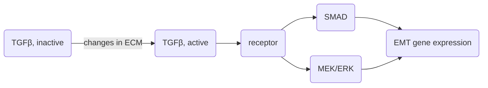

> [!question] Questions
> - Tumour cells establish ecosystems that activate cellular programmes for local invasion and distant metastasis. Discuss communication within these ecosystems with reference to at least two signalling pathways.
> - *==How would you determine the metastatic potential of a primary tumour? (=tendency to form a secondary tumour)==*

# Defining metastasis 
- Metastasis is actually a rare event as there are many challenges for cancer cells to go through before they can metastasise
	- Breaking through tumour border 
	- Surviving foreign environments of the blood – mechanical forces 
	- Establishing in the secondary site 

# Drivers of metastasis 
## Cell-intrinsic
### Mutations 
- Certain mutations may drive metastasis in cancer cells 
- #experimental_evidence We can select for cell-lines that metastasise to certain organs, e.g. "lung-tropic", "liver-tropic" 
	- This involves repeated cycles of growing cells in a lab, injecting them in a mouse, extracting them from the particular organ, and repeating this multiple times. 
- #experimental_evidence Nguyen et al (2022) – a large study on 25000 patients with 50 tumour types found that there is some correlation between mutations and metastasis 
	- TP53 tumour suppressor mutations and chromosomal instability predict metastasis 
	- Some mutations can predict which organ(s) the tumour will metastasise to 
	- Some were found to correlate with metastatic burden and there are mutations that correlate with specific organ metastatic sites

### Gene expression 
- Metastasis often involves epithelial to mesenchymal transition (EMT) so that the cell can acquire the ability to break through basal membranes
- EMT is part of normal development, but cancer cells hijack these pathways to allow differentiated epithelial cells to become mesenchymal 
- Several master TFs control EMT: ZEB1/2, SNAIL1/2, TWIST1, and these take input from a variety of signalling pathways ^8cee46
- Gene expression programmes are deregulated to drive several EMT changes, including: cytoskeleton remodeling, loss of apical-basal polarity, cell-cell junction weakening, cell-matrix adhesion remodeling, cell individualisation, establishment of front-rear cell polarity, acquisition of cell motility, basement membrane invasion. 
- However, not all metastatic cancers go through EMT... if a tumour goes through EMT and becomes more mesenchymal, probably it is more metastatic, but there are tumours that look epithelial and yet have metastasis 
![[Pasted image 20230411132504.png|450]]
### Models of metastasis evolution 
- There are multiple models of how cells evolve metastasis, and how the subsequent secondary tumours evolve 
- **Linear progression model**. Metastasis-competent clone arises late during cancer development, and migrates somewhere else before the primary tumour is detected. 
- **Parallel progression model**. Metastasis-competent clone migrates from primary tumour early, and both primary and secondary tumour evolve in parallel. This results in greater genetic divergence between the primary and secondary tumour. 
- A single subclone might seed one or multiple sites, or multiple clones might seed one or multiple sites. 
- **Cross-seeding** can occur where a metastasis infiltrates another metastasis. 
- **Self-seeding** can occur where the metastasis re-infiltrates the primary tumour. 
![[Pasted image 20230411144114.png|525]]

## Cell-extrinsic 
- Cancer cells may cooperate with "healthy" cells to survive during metastasis
	- E.g. recruit platelets to form a protective layer and allow them to survive in the blood vessel 
- **Formation of a pre-metastatic niche.** there is evidence that tumours release exosomes that can make their way to other sites e.g. liver, lungs, to change the properties of those sites even before detection of tumour cells there. These factors may make it more easy for them to metastasise to another site, making it more hospitable. 

### Physical forces
- Physical forces on tumours act as a selection pressure for tumours to evolve metastatic ability and thus escape these forces. 
- **Solid stress:** Tumours are often overgrown, resulting in solid pressure as it presses against the ECM 
	- #experimental_evidence Tse et al (2011) – compressive stress stimulates migration of mammary carcinoma cells. Pressed normal cells and cancer epithelial cells against a membrane surface with a weighted piston. Compressive stress found to promote the formation of "leader cells" which form filopodia. 
- **Fluid pressure**: Interstitial fluid within tumours is under pressure, due to leakage of plasma from abnormally permeable tumour blood vessels and insufficient lymphatic drainage, resulting in fluid leaking out of tumour and into peritumor tissue. This causes edema and facilitates invasion through flow-induced shear stresses 
- **Stiffness**: Formation of fibrous scar tissue in the matrix around the tumour. This fibrous matrix forms a cage that prevents the tumour from escaping, forcing the tumour to fit through tight spaces to metastasise. This can deform the nucleus and cause DNA damage, possibly resulting in new mutations 
	- Cells can sense the stiffness of the environment they are in due to coupling of the cytoskeleton and the ECM. This activates genes that make them more likely to divide and more migratory
		- E.g. forces on the cytoskeleton drives YAP/TAZ TFs into the nucleus to activate transcription
		- E.g. [[D12 Invasion and Metastasis#^f343c7|TGFβ]] can be activated by myofibroblast-induced tensile forces on the ECM 
	- This happens in normal embryos, and is how tissues control their size/shape, but in cancer this can trigger aggressive metastatic behaviour 
	- On the other hand, the ECM could also provide "roads" for the cells to escape
	- So stiffness can be both good or bad for metastasis; there could be an optimum level of stiffness that depends on the tissue's endogenous stiffness. 
		- From a clinical point of view, normalising the stiffness of the tumour could be best. Don't make it too stiff so as to excite cells, but also stiff enough to hold tissue together 
- **Microarchitecture**: Cancer growth and invasion disrupts the microarchitecture of the surrounding tissue. Stromal cells, cancer cells, and ECM are organised in a new way, changing how each cell interacts with its surroundings. 
	- When the membrane is deformed, Ca2+ can enter cytoplasm through stretch-activated ion channel, Piezo1. This suppresses protein kinase A activity, which regulates [[C3 Cytoskeleton and Organelle Movement#RhoGTPase|RhoA]] and [[C3 Cytoskeleton and Organelle Movement#Rac|Rac1]] GTPases involved in activating migration 

### Chemical signals 
- **Diffusible and bound signals**. E.g. TGFβ is a signalling factor secreted by cells into the ECM as an inactive complex termed the "large latent complex". The action of proteases, pH, ROS, matrix stretching by integrins, etc. can cause the dimer to be released and activated. Activated TFGβ binds to receptors to trigger downstream S/T kinase pathways, SMAD and MEK/ERK. These pathways drive EMT.  ^f343c7

- **Chemotactic signals**. e.g. Lysophosphatidic acid (LPA) – Cancer cells use chemotaxis to migrate towards positive growth and survival environmental conditions (e.g. blood). LPA receptors are GPCRs to activate G-protein signalling. The signalling cascade leads to migration, proliferation, and other pathways. 

### Extracellular matrix 
- Some tumours have huge amounts of ECM around them (e.g. pancreatic tumours) produced mostly by surrounding fibroblasts
- #experimental_evidence The matrisome (components of the ECM) can be studied with proteomics techniques, such as LC-MS/MS (see [[A1 Mass Spectrometry and Proteomics#Characterising protein complexes with tandem MS|tandem MS]] and [[A1 Mass Spectrometry and Proteomics#MS and proteomics|MS and proteomics]]) 
- #experimental_evidence Socovich & Naba (2019) – 22 matrisome components have been identified to correlate with ovarian cancer metastasis, including collagens, ECM glycoproteins, proteoglycans, and ECM regulators. 

### Microenvironment cells
- Many cells exist in the cancer microenvironment ([[D13 Tumour microenvironment]])
- **Cells in the microenvironment can be cancer promoting or cancer inhibiting**, determined by the environment (e.g. [[D12 Invasion and Metastasis#Physical forces|physical forces]]) and cross-talk with other cells in the microenvironment (also see [[D13 Tumour microenvironment#B cells]])![[Pasted image 20230411135027.png]]
#### Cancer-associated fibroblasts (CAFs)
- CAFs remodel the ECM and signal to other cells (see [[D13 Tumour microenvironment#Cancer-associated fibroblasts remodel the tumour ECM|CAFs]]) ![[Pasted image 20230411135041.png]]
- CAFs secrete metabolites, extracellular vesicles, and ECM, which nourish the cancer; in turn, cancer cells also release metabolites that can stimulate fibroblasts, resulting in a symbiotic relationship ![[Pasted image 20230411135522.png|200]]
- CAFs may also stimulate or suppress immune cells with metabolites, but this is unclear ![[Pasted image 20230411135534.png|300]]
- CAF breakdown of collagen in ECM releases free proline to help cancer cells sustain their metabolism (collagen contains many hydroxyproline)

#### Tumour associated macrophages (TAMs)
- TAMs can be protumourigenic or antitumourigenic ![[Pasted image 20230411140037.png]]
- Normally, macrophages are inflammatory and attack the tumour by releasing interferons and cytokines.
- But tumours can reprogram macrophages to become pro-tumourigenic, by promoting angiogensis and opposing T cells 
- TAMs also exhibit cross-talk with fibroblasts, creating feedback loops that cause immune suppression and support cancer cell growth
	- E.g. fibroblasts secrete CSF1 and CCL2, which stimulate macrophages to secrete PDGF, AREG, or IL6 and TGFβ, which in turn stimulate fibroblasts ![[Pasted image 20230411140404.png]]

# Process of metastasis
1. Escape from the primary tumour
	1. Breach of epithelial basement membrane 
	2. Invasion of extracellular matrix 
	3. Formation of invadopodia (see [[Ridley_2011]]) and secretion of matrix metalloproteases (MMPs)
2. Intravasation – cancer cells gain entry into blood vessels 
	1. Involves breach of endothelial wall and survival in bloodstream 
3. Extravasation – cancer cells escape back out of blood vessel and into extracellular space of new organ/tissue
4. Cancer cells die, go dormant, or grow into a metastasis 
	1. When a cancer cell is dormant, it does not proliferate immediately when it goes to a new site. Some evidence that this happens but we don't know how this happens. Hard to find dormant cells in body – too small.

# Studying invasion and metastasis
## Challenges
- Tumour trials usually measure tumour shrinkage, but if looking for metastasis, need to treat someone for a long time
- Expensive to treat someone for a long time
- Also ethically questionable – patient has to be treated for much longer vs just removing the tumour via other means (e.g. surgery) 

## Proxies for measuring migration  of cancer cells in a monoculture 
- Cell shape: If there is a more elongated shape, may be moving
	- Aspect ratio of length/width
	- Circularity 
	- Tools: ImageJ, Cell Profiler 
- Migration speed: Can reflect metastatic potential of the cell 
	- Cell tracking (using video) – may be manual or via computer vision (segmentation)
- Migration mode: Some workers describe distinct migration modes e.g. amoeboid vs mesenchymal, but it is really a continuum using a mixture of modes or underlying machinery. 
 - #experimental_evidence Li et al (2011) – RAC1 KO melanoblasts have rounder shape than wt cells and move more slowly 

## In-vitro invadopodia formation 
### Advantages
- In vitro methods are good for understanding basic molecular mechanisms, and probably easier than studying it in e.g. a mouse. 
- Easier to manipulate and do biochemical assays
- Easier to screen in high throughput

### 2D methods 
- Invadopodia formation – number of cells with invadopodia, number of invadopodia per cell, area of invadopodia per cell, amount of degradation of matrix (e.g. area of matrix degraded) 
- On glass slide, add a thin gelatin matrix and add cells on top. Cancer cells will make small holes in the matrix with invadopodia. Proteins involved in invadopodia can be visualised with immunofluorescence, and points of fluorescence will overlap with the holes in the matrix. 
- HOWEVER, some normal cells can also do this, e.g. fibroblasts, endothelial cells. These are not epithelial cells though. 

### 3D methods 
- **Grow cells as spheroids** in hanging drop or other method, plate into reconstituted collagen gels, measure distance invaded and area of invaded cells 
	- Can also mix mutant and WT cells (e.g. fibroblasts) to look for "leader" cells, measure proliferation, fix and stain or live imaging 
		- In some less invasive cancers e.g. squamous cell carcinoma, fibroblasts can act as leading cells to pave the way for invading cancer cells (Gaggioli et al)
- **Filter assay**. Seed cells on a filter with or without added matrix. Add medium with chemoattractant (serum or growth factor). Use confocal microscopy to slice through gel (e.g. collagen) in the well and measure number of cells invading deep into the gel. If no chemoattractant is added (only gel), then it is called an inverted invasion assay. Plot number of cells or area occupied by cells at each slice – greater depth of migration represents greater invasive ability. #comment re-look at this
- **Organotypic assays**. Fibroblasts in collagen (normal or cancer-associated) are incubated for a few days, then they are killed and cancer cells are plated on top. An air liquid interface is kept by placing the collagen on a supporting mesh on top of liquid media. Observe for cancer cells invading into the collagen plug. ![[Pasted image 20230411145707.png|400]]
	- Skin cells normally have an air-liquid interface to model what it looks like in the skin. 

## Modelling points in the metastatic cascade 
- No way to model whole process of metastasis in tissue culture 

### Patient derived organoids 
- Bioengineered matrix, patient derived organoids
- Have been used to model a patient's response to therapy 
- But timing is crucial, not all biopsies give successful organoids. 
![[Pasted image 20230411145752.png]]
### Mouse models
[[D9 Experimental Models#Mice]]
- Mice as a pre-clinical model

#### Disadvantagaes 
- But immunodeficient mice cannot model role of immune system in metastasis 
- Mice live shorter life spans than humans, so often die of primary tumour before metastasis occurs 

#### Transplantation
- Injection into tail vein
- Injection under the skin
	- But skin is not the microenvironment of most tumours 
- Orthotopic transplantation – injection of tumour cells at site where tumour would normally be 
	- More faithful to human disease
	- But more complicated and more invasive to mouse 

#### Intra-vital imaging
- Imaging windows can be surgically introduced e.g. in abdomen, cranium, mammaries. Organs can be glued to the window. 
	- No effect on mouse health 
- Skin fold chambers 

#### Genetic models
- For studying genetic predisposition to cancer 
- Using Cre-loxP system
	- Remove a stop codon to start expression 
	- Remove part of a gene to disrupt expression
- But mice take a long time (~50 days) from mutation to cancer 

#question What proportion of mice with a mutation get cancer? Probably depends on gene, any that are 100%? 

[[Do mutations drive cancer?]]

### Drosophila models 
- Fly cancer avatars 
- Sequence cancer -> recreate fly with cancer mutations, then test fly with different drugs
- Don't know how transferable to humans... 

# Inhibiting metastasis 
## Pipeline for drug development 
- Including for anti-metastatic drugs 
- But pipeline for studying anti-metastatic drugs still expensive and speculative
- Immune therapies could help as it is a systemic response 

Conway et al 
#comment link to Drug-based therapies for cancer 

## Liquid biopsies
- Used to detect circulating tumour cells, tumour DNA, metabolites, extracellular vesicles
	- Any body fluid – blood, urine, saliva, etc. 
	- Breath tests 
- Less invasive than biopsies and less material needed for detection of cancer (cf CT scans, which can only detect larger tumours) 
- Can be used at multiple stages for cancer diagnosis and predicting relapse – detect cancer when tumour is still small, so can treat patient before it develops into a larger tumour 
- But can be expensive and needs very sensitive detection; false negatives are likely 

## Challenges in designing anti-metastatics
- Metastasis is complex and heterogenous. Source for tumour cells for metastasis is elusive. 
- Clinical trials have to be done over a long time period 
	- Dormant tumour cells can reside in body for years
- Lab assays do not faithfully recapitulate real metastasis 100% 
- We don't know when metastasis happens – can happen early or late. 
	- We do know that there is increasing release of metastatic material over time. The earlier a primary tumour is removed, the more likely the patient is to survive in the long-term. 
- EMT is difficult to inhibit – need to inhibit TFs that control EMT and these are probably pleiotropic. People have not tried to KO all 6 TFs at once. Compensation also occurs. 
- Need more sensitive methods of detecting metastases early 

# Links 
- miRNA – [[D7 Small RNAs and cancer#^d0aacd]]