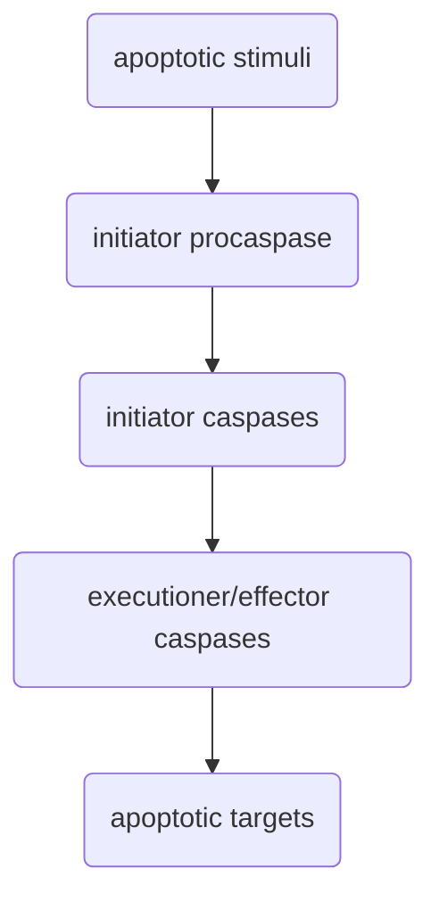
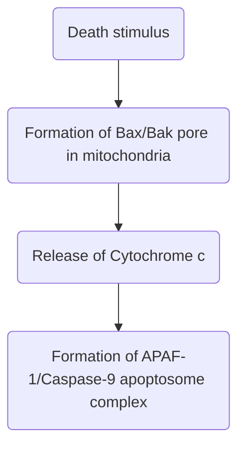

# Question
- How is apoptosis important to the development of a cancer?
- ==Apoptosis kills unwanted infected or damaged cells. However, healthy cells have to prevent apoptosis. Discuss how accidental death is avoided and how tumours can exploit this.==
- How is cell death evaded in cancer?
- Compare and contrast the mechanisms by which tumour cells and viruses each evades apoptosis.
- What determines whether a cell lives or dies?
- The apoptotic machinery broadly consists of oncogenes and tumour suppressors. How are they organized and what are their interdependencies?

# Function of apoptosis 
- Tissue homeostasis 
- Development (e.g. finger development)
- Immune response (inducing apoptosis in abnormal or virus-infected cells)
- T cell selection – T cells that produce antibodies that target self are destroyed 
- Tissue regeneration – removing dead cells that were killed from tissue injuries so they can be replaced by new healthy ones 
- Tissue regression e.g. in mammary glands, regresses at end of lactation period due to involution and apoptosis 

# Features of apoptosis
- Rapid execution, 20x faster than mitosis 
- Phenotypes are only obvious for a short time period 
- Rapid clearance of cells
- Different from necrosis! 
  ![[Pasted image 20230405115956.png|400]]

## Morphological features  
- Cytosolic chrinksage
- Nuclear fragmentation (Karyorrhexis)
	- DNA fragmentation 
	- Breakdown of nuclear envelope 
- Blebbing
- Apoptotic bodies
- Cellular detachment
- Phagocytosis (removal of cell debris)
- Disassembly of Golgi apparatus 
- Exposure of Phosphatidylserine (PS) as "Eat me" signal at the outer leaflet of cell membranes. Signals to phagocytes 
  ![[Pasted image 20230405115855.png|375]]

# Caspases
- Caspases = ==Cysteine-dependent ASPartate-directed **proteases**== 
	- Cleave after Asp – canonical motifs exist e.g. NNNN==DEVD==NNNN
- Activated during apoptosis 
- Initiator caspases = Caspase-2, 8, 9, 10 
- Effector caspases = Caspase-3, 6, 7 
- Inflammation caspases = Caspase-1, 4, 5, 12

### Structure
- Initiator caspases (2, 8, 9, 10) have a prodomain motif, P20 domain, and P10 domain each separated by aspartate cleavage sites 
	- DED box = Death Effector Domain 
	- CARD = CAspase Recruitment Domain 
- Effector caspases (3, 6, 7) have a short prodomain motif and p20 and 10 domaisn 
![[Pasted image 20230205155815.png|475]]

## Activation 
- Two initiator caspases can dimerise via prodomain interactions, which then results in activation and reciprocal cleavage at Asp cleavage sites, resulting in formation of a heterodimer  
- Fully activated initiator caspases activate effector/executioner caspases, which exist as dimers in the zymogen state, by cleaving at Asp cleavage sites 

![[Pasted image 20230205193649.png|350]] #comment draw a better diagram to replace this 
- Initiator caspases 8 and 9 regulate the effector caspases 3, 6, and 7 in the following way: 

![[Pasted image 20230205193736.png|350]]

## Targets 
- Freeing cell from contacts
	- Cell-cell contacts e.g. cadherin, β-catenin, desmocollin-3, desmoplakin, plakophili, allowing for release of cells 
	- Cell-ECM contact e.g. focal adhesion kinase (FAK), vinculin, paxillin, integrins, stress fibers, allowing for release of cells 
- Facilitating nuclear fragmentation 
	- Proteins involved in nuclear matrix/scaffold association regions (N/SAR), e.g. LAP2, allowing for nuclear fragmentation 
	- Activation of Mst1 by Caspase 3 to phosphorylate Histone 2b → chromatin condensation 
	- Cleavage of Lamin A/B to facilitate nuclear envelope break down 
	- Cleavage of Inhibitor of Caspase Activated DNAse (ICAD). This releases inhibition of Caspase Activated DNAse to break down DNA 
- Golgi apparatus
- Transcription factors
- Survival pathways
- Organelles 

# Extrinsic pathway
- **Death receptors** (part of TNF receptor superfamily) have extracellular domains that allow for homotypic interactions with cognate ligands that can be soluble ligands or ligands on the surface of neighbouring cells, e.g. CD95 Fas/APO-1 is activated by CD95L 
  ![[Pasted image 20230405120902.png]]
- **Formation of higher order complexes is needed for activation**. The death receptors form trimeric complexes that then bind to trimeric ligands, building up higher order complexes at the cell membrane. 

## Caspase activation 
- Interaction between the death receptor and its ligand results in recruitment of a procaspase to form the Death Inducing Signalling Complex. 
	- Death domain on intracellular regiom of receptor interacts with DED domain on procaspase 
	- E.g. CD95 recruits Pro Caspase 8 

## Regulation of death receptors
- Some death receptors are able to signal to either ==survival pathways== or ==apoptotic pathways== depending on the type of ==post-translational modifications== on the proteins they recruit
	- E.g. TNFRI can recruit TRADD, TRAF2, and RIP1 to form Complex I, which activates NF-κB and thus downstream survival pathways. However, if the proteins in the complex are modified, they can dissociate from TNFRI into the cytosol, resulting in recruitment of FADD which in turn recruits Procaspase that in turn recruits Caspase-8/10 via DED boxes to form Complex II. Complex II induces apoptosis. 
	  ![[Pasted image 20230205195530.png|325]]
	- cIAP1 can lead to NF-κB signalling from Complex I and cell survival – facilitates ubiquitination on RIP1, NEMO. Degradation of cIAP1 leads to complex II formation and cell death. 
![[Pasted image 20230205200303.png|325]]
 - ==Competitive binding==. 
	 - E.g. cellular FLICE inhibitory protein (cFLIP) can bind to and inhibit Caspase-8 as it resembles procaspase-8/10 and binds to DED motif on FADD recruited to CD95. This prevents Caspase-8 from binding. 
	   ![[Pasted image 20230205195916.png|375]]
		 - This gene is close to Caspase-8 in the genome, and may be a gene duplication. 
		 - Viral analogues of cFLIP may inhibit Caspase-8 recruitment to prevent extrinsic pathway, which is normally the pathway the cell would use to kill the virus
		 - cIAP1 leads to NF-κB signalling from Complex I and upregulation cFLIP 

## Exploitation by tumours 
- Maintain ability to target and kill cytotoxic T cells that might target the tumour cell 
- TRAIL and tumour cells – TRAIL receptors are upregulated in tumour cells. May be a proapoptotic therapeutic approach to target tumour cells. 
- Myc inhibits cFLIP which releases inhibition of initiator Caspase 8 
- A **synthetic lethality** approach might be developed where a small molecule mimic of Smac is used to inhibit XIAP. With inhibition of both initiator Caspase 8 and effector Caspase 3 lifted, apoptosis is induced in cancer cells 
	- #experimental_evidence Huang et al (2011)
![[Pasted image 20230205200458.png|300]]

# Intrinsic pathway 

- Death stimuli include are internal chemical stimuli (not external ligands like in extrinsic pathway), e.g. DNA damage, infection, oncogene activation, ROS, heat shock, unfolded protein response, ER stress, loss of cell-cell contact, cytoskeletal damage, growth factor withdrawal 
	- In cancer, p53 can signal to *Bim*, *Puma*, etc. which activate Bax/Bak for [[D3 Oncogenes and Tumour Suppressors#Intrinsic tumour suppression|intrinsic tumour suppression]] 
- Release of cytochrome c through pores formed by members of Bcl2 family (e.g. Bax, Bak)

## Apoptosome formation 
1. Cyt C binds to C-terminal APAF-1 WD40 domains, releasing CARD domain (ATP-dependent)
2. 7 APAF-1 monomers aggregate to form a wheel-shaped heptamer via CARD domains 
3. Caspase-9 is recruited to the CARD domain via procaspases 
4. Caspase-3 is activated by Caspase-9 in the apoptosome 
![[Pasted image 20230206002855.png|425]]

## Regulation 
### XIAP 
- XIAP = X-linked inhibitor of apoptosis
- Different caspases can bind to BIR domains in XIAP e.g. caspase-3, 7, 9, which inhibits the caspases 
![[Pasted image 20230206003040.png|400]]
- XIAP can thus inhibit the apoptosome by binding to different caspases in the apoptosome 
	  ![[Pasted image 20230405123315.png|350]]
- XIAP binding to caspases is itself inhibited by Smac/Diablo, which is also present in intermembrane space of mitochondria. 
	- Smac can also be released from the mitochondria via pores along with Cyt C, and if released in sufficient levels it can inhibit XIAP to promote cell death. Balance of these factors determines whether apoptosis occur
		- #comment These kinds of balances may be common in biology. How has systems biology approaches been used to study them? 
![[Pasted image 20230405123513.png|575]]

### Bax and Bak 
- MOMP = mitochondrial outer membrane permeabilisation
- Bax and Bak are bcl-2 family proteins
- Bas and Bak trigger MOMP 
- When activated by other members of the Bcl-2 family, the Bcl-2 homology 3 domain (BH3) is exposed, resulting in dimerisation via BH3 binding. 
- Bak already resides in the mitochondrial membrane, while Bax is only inserted into the membrane upon activation 
- Formation of higher order complexes by Bax or Bak allows for the formation of pores, which can be channels lined with Bax or Bak protein, or lipidic pores 
![[Pasted image 20230405123801.png|400]]

### Regulation by Bcl-2 and BH3 proteins 
- Regulated by other members of Bcl-2 family (e.g. Bcl-2)
	- Contain BH1-4 domains 
- Bax and Bak spontaneously acquire an active conformation, and anti-apoptotic Bcl-2 members reverse Bax or Bak to an inactive conformation 
	- Bax – Bcl-XL, Bcl-2, Bcl-W, Mcl-1
	- Bak – Mcl-1, Bcl-XL 
- BH3-only proteins, e.g. Bad, Bim, Bid, Puma, activate the Bcl-2 protein
	- In the direct activation model, BH3-only proteins can inhibit Bcl-2 and/or activate Bax/Bak directly
	- In the indirect activation model, BH3-only proteins inhibit Bcl-2 proteins to release Bax/Bak from activation 
![[Pasted image 20230206004410.png|400]]
- Different BH3-only proteins are upregulated by distinct stimuli, such that the set of BH3-only proteins that are upregulated lead to distinct outcomes and dictate how potent the death stimulus is 
  ![[Pasted image 20230405124349.png|400]]
- Multiple layers of complexity in regulation ensures that apoptosis is not activated spuriously 
	- Similar to [[D1 DNA Replication#Multiple pathways of inhibition are required|DNA replication]] where multiple modes of regulation of pre-RC formation are required to ensure it only occurs once 
- Balance between Bax/bak and Bcl2/BclXL determines whether apoptosis occurs

### Post-translational modifications 
- Apoptotic signals can enhance half-life of pro-apoptotic proteins
- E3 ligases ubiquitinate *MCL-1* 
- *MCL-1* phosphorylation targets it for ubiquitinylation by E3 ligases 
	- MCL-1 contains multiple phosphorylation sites. Phosphorylation at T163 by JNK triggers subsequent phosphorylation of S159 then S155 by GSK3 
	- However if MCL-1 is only phosphorylated at T163 (e.g. if GSK3 activity is inhibited by AKT signalling), then MCL-1 is stabilised ![[Pasted image 20230529224809.png|500]]
- BIM destabilised by ERK phosphorylation at S69, which marks it for ubiquitination 
- Phosphorylation can also alter activities of apoptotic regulator 
	- In general, phosphorylation by pro-survival kinases suppresses proapoptotic functions, while phosphorylation by propapoptotic kinases (e.g. GSK3 and JNK) activates proapototic proteins or inhibits antiapoptotic proteins 
	- E.g. proapototic BAD inhibited by PAK1, AKT 

### miRNAs 
- miR-15 and miR-16 inhibit *BCL-2* mRNA 
- miR-29b, miR-101 and miR-193a-3p suppress *MCL-1* mRNA translation 

# Cross-talk between extrinsic and intrinsic pathway 
![[Pasted image 20230206004533.png]]
![[Pasted image 20230529221347.png|500]]
- E.g. Death receptors can amplify their signalling by triggering Bid-mediated activation of Bax-Bak spores 

# Relation to cancer 
- To proliferate, cancer cells need to prevent apoptosis, probably via multiple mechanisms 

## Cancer cells upregulate antiapoptotic signals 
- #experimental_evidence Mouse models with genetic inactivation of BH3-only proteins or caspase accelerate tumour development 
- E.g. colon cancer – loss of ability to remove the damaged cells from the intestinal crypt can result in formation of an *adenoma*. Particular mutations in an early adenoma (e.g. APC, KRAS, SMAD2/4) can result in further development of the adenoma into a carcinoma, and eventually metastasis. 
- E.g. amplification of BCL-XL gene has been observed in lung and giant-cell bone tumour 
- Oncogenic signalling upregulates anti-apoptotic proteins ![[Pasted image 20230529222453.png]]
- Stabilisation of MCL-1 

## Cancer cells downregulate propapototic signals 
- Downregulation of miRNAs that target antiapoptotic proteins e.g. miR-15 and miR-16 reduced in chronic lymphocytic leukemia, miR-101 reduced in hepatocellular carcinoma 
- Loss of p53 
- Loss of Bax, PUMA, NOXA, APAF-1 
- Overexpression of AKT, ERK leads to suppression of FOXO transcription factors. Since FOXOs induce *BIM* expression, AKT and ERK signalling suppresses *BIM* 
- Downregulation of caspase genes, *APAF-1*
	- Transcriptionally regulated in response to E2F1 or p53, which are downregulated in cancers 

## Evasion of targeting by cytotoxic T cells 
- Cytotoxic T-cells can induce apoptosis in cancer cells via extrinsic pathway 
- Can use FAS ligand to target FAS receptors on target cancer cell, which would then lead to apoptosis via extrinsic pathway ![[Pasted image 20230405124645.png|425]]
- Can use perforin to create pores in target cell, and release granzymes into target cell to initiate death programme. If apoptosis is intact, it will be engaged, but death can occur even without it  
![[Pasted image 20230206005212.png|325]]

## Immunotherapy
- Binding of PD-L1 expressed on surface of tumour cells to PD-1 expressed by cytotoxic T-cell inhibits T-cell from killing tumour cell. However, if an antibody is used to block PD-1 or PD-L1, the T-cell can resume killing tumour cell ([[D14.3 Immune therapies]])
	- Other similar immunotherapies exist that involve blocking ligand-receptor interaction between cytotoxic T-cells and cancer cells 
	- E.g. Melanoma can be treated with a combination of Nivolumab and Ipilimumab 
![[Pasted image 20230405124827.png|350]]

## Remaining issues 
- Does survival of cancer cells depend only on relative abundance of proapoptotic BH3-only proteins to antiapoptotic BCL-2 proteins? Or is it the relative level of signalling? (e.g. activity of these proteins can be regulated by PTMs) 
- Heterogeneity in silencing apoptotic machinery – can we predict which pathways are altered in particular cancers? 
- Caspase-independent cell death – important to cancer? 