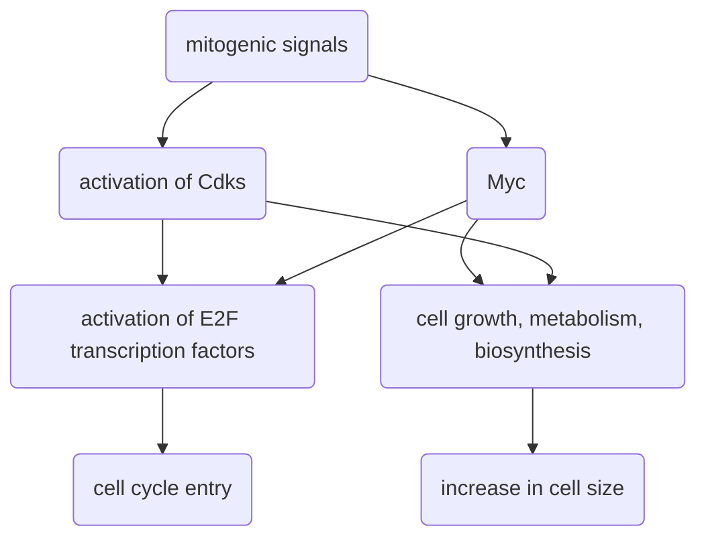

- Cells are assembled into heterogeneous, complex tissues comprising many cell types
- How do cells know their own identity, where they are and how to interact with neighbours? --> External signals! 

# Vertebrate cell proliferation depends on mitogens, not nutrients 
- Generally, component cell proliferation is not regulated by nutrient availability as there is usually a high level of nutrients available (compare to unicellular organisms e.g. yeast)
	- Cancer is an exception
- Rather, proliferation is regulated by mitogens secreted by other cells, and is not autonomous 
	- Cancer is an exception 

# Survival and growth factors  
- Survival factors, e.g. insulin-like growth factors I and II (IGF-I, II) in fibroblasts, interleukin-3 in meyloid cells 
- Epithelial cells also can derive survival signal from association with extracellular matrix 
- Survival factors prevent apoptosis by triggering RTKS -> Ras -> PI3K cascade (particularly Akt/PKB kinase)
- Some cytokines also trigger PI3K-independent activation of STATS, NF-κβ which modulate transcription of Bcl2-related proteins, anti-apoptotic genes -> cell survival 
- Oncogenes can super-activate apoptotic and senescence programmes to overwhelm social buffering capacity. of local trophic factors 
- To reduce dependency on growth/survival factors secreted by neighbouring cells, tumours often accumulate mutations in IGF pathway, PI3K pathway to activate them independent of growth factors 

# Reaction/commitment point is in late G1
- Vertebrate cells typically decide whether to proliferate or not at the restriction/commitment point in late G1 
	- The timing of this commitment point varies with cell types, such that length of G1 phase differs between cell types
	- Some cells with longer growth times may need to be larger, or are subject to more checks and balances before they can commit to proliferation 
	- Sustained mitogenic signaling is required up to the commitment point
		- May be because mitogens prevent decay of short-lived intracellular molecules required to drive increase in cell size, and maintain cell cycle progression 
	- At this point, mitogens are no longer required for commitment to cell cycle progression 
- The commitment point coincides with the *restriction point*, which is the point up to which cells require significant macromolecular synthesis for progression into S phase 
- At this point, the cell has three choices, which are to 
1. Proceed through the cell cycle
2. Don't proceed, extend G1 period 
3. Enter a long-term quiescent state (e.g. G0, terminal differentiation, replicative senescence)
- Many oncogenes, tumour suppressor act on restriction/commitment point
	- Proto-oncogenes: Promote progress through commitment point. E.g. Myc, Cyclin D1, E2F1-3, mitogenic signals
	- Tumour suppressors: Inhibit progress through commitment point, e.g. p221cip1, p53, cytostatic signals

# Mitogens
- **Function**. To engage and maintain expression of multiple genes governing diverse biochemical pathways that are together required for cell proliferation 
- Mitogens first rapidly induce ==immediate early genes== (e.g. c-Fos) which can occur in the absence of *de novo* protein synthesis
	- These immediate early genes may be primary transcription factors that open up the chromatin for later expression 
- However, non-mitogenic signals may also transiently induce many of the same immediate early genes in response to non-mitogenic stimuli and in no-proliferating other cell types 
	- E.g. c-Fos protein is induced in post-mitotic rat visual cortex after exposure to light 
- Therefore, immediate early genes are actually just ==generic switches== whose outputs depend on cell type and context. 

## Outputs

### E2F transcription factors
- E2Fs are activated in mid/late G1, and they drive G1 expression of genes needed for cell cycle entry and progression 
- E2F1, 2, and 3a are mitogenic, while the rest are antiproliferative
- E2F TFs act as dimers with DP1/2 co-factors 
- Target genes involved in cell cycle, DNA synthesis, DNA repair etc. However, they also upregulate genes that act are involved in checkpoints, apoptosis, and anti-proliferation. This ensures that proliferation only proceeds when the cell passes all checks. 

#### Regulation by p105 Rb
- One-hit, two-hit hypothesis in hereditary retinoblastoma vs spontaneous Rb
- Tumour suppressor 
- p105 Rb binds E2Fs in its "pocket" domain, sequestering E2F in an inactive state and recruiting proteins that remodel chromatin e.g. BRG1 (HDAC) to repress transcription 
- p107 and p130 are closely related but are not tumour suppressors

![[Pasted image 20230210092708.png|475]]

- During G1, mitogenic signals activate G1 cyclin CDK, which in turn inactivates pRB to liberate E2F function 
![[Pasted image 20230405130953.png|300]]
-  G1 Cdk phosphorylates pRB, preventing it from sequestering E2F 
  ![[Pasted image 20230405130731.png|550]]
	- Rb becomes increasingly phosphorylated through cell cycle from late G1 to G2/M, as S and M-Cdks keep Rb inactive 
	  ![[Pasted image 20230405130926.png|475]]

### Myc 
- Proto-oncogene, required for proliferation of normal cells. 
- Induced more slowly than immediate early genes (e.g. c-Fos)
- Depriving the cell of Myc during cell cycle causes it to arrest at nearest available opportunity (not immediately)
- Only c-myc is mitogen-dependent, N-Myc and L-Myc depend on developmental stages 
- Myc haploinsufficiency reduces body size as it regulates both cell size and cell number (at least in *Drosophila*) 

### Target genes 
- Highly pleiotropic 
- Myc binds the E-box motif CACGTG, of which there are thousands in the human genome and it can bind specifically to up to 15% of all coding genes 
- These target genes are implicated in diverse functions, both intracellular (e.g. cell growth, protein synthesis, apoptosis, etc.) and extracellular (e.g. chemokines, interleukins, cell adhesion, etc.)
![[Pasted image 20230405131153.png|400]]

### Cross-talk 
![[Pasted image 20230210094458.png|525]]

#experimental_evidence 

# Sensing aberrant proliferation 
- ARF is rapidly induced in response to aberrant signals e.g. Myc 
	- Arf is only active when a signalling threshold is exceeded 
- ARF promoter is suppressed by E2F3b, but in the presence of E1A or E2F1, E2F3B is displaced from ARF promoter, so that activator E2Fs can bind 
	- This results in different activity of ARF between normal and oncogene-expressing cells 
